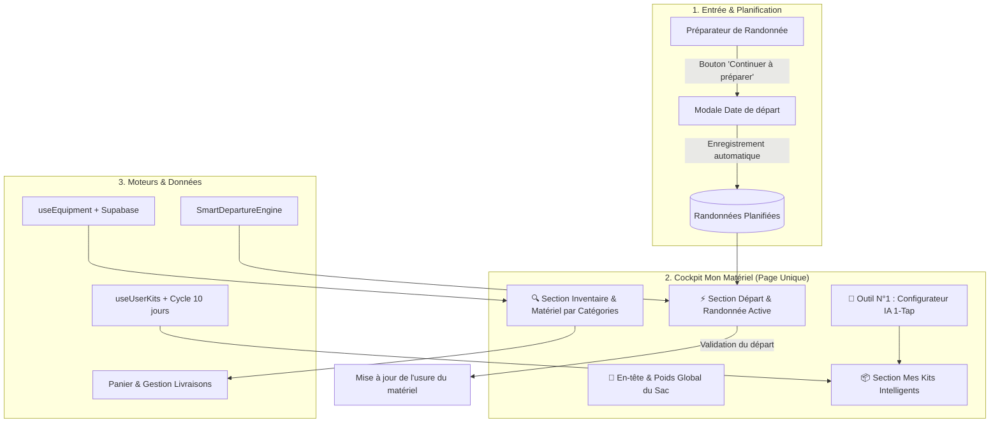

# 🧭 LKDV — « MON MATÉRIEL » : GUIDE COMPLET D'ARCHITECTURE & FONCTIONNEMENT DU SYSTÈME UNIFIÉ

> **Vision Produit :** *« Je n'ai presque rien à faire, LKDV a déjà pensé à tout. »*  
> **Aura & Design System :** Minimalisme Apple × Précision outdoor AllTrails × Intelligence contextuelle LKDV.  
> **Palette Officielle :** Vert forêt primaire `#17402C`, fond papier chaud `#FBFAF6`, surfaces `#FFFFFF`, bordures subtiles `rgba(11,31,23,0.06)`. *(Zéro orange).*

---

## 📑 Sommaire
1. [Principes Fondamentaux & Refonte Globale](#1-principes-fondamentaux--refonte-globale)
2. [Structure & Agencement sur la Page Unique](#2-structure--agencement-sur-la-page-unique)
3. [Le Flux Continu : Préparateur de Randonnée ➔ Mon Matériel](#3-le-flux-continu--préparateur-de-randonnée--mon-matériel)
4. [Gestion Anti-Conflit Délais de Livraison vs Date de Départ](#4-gestion-anti-conflit-délais-de-livraison-vs-date-de-départ)
5. [Le Moteur de Préparation Intelligente & Consommables](#5-le-moteur-de-préparation-intelligente--consommables)
6. [Le Cycle de Vie des Kits & Auto-Substitution](#6-le-cycle-de-vie-des-kits--auto-substitution)
7. [Inventaire & Matériel : Toggle Épuré & Catégories](#7-inventaire--matériel--toggle-épuré--catégories)
8. [Base de Données, Modèles Supabase & Fonctions SQL](#8-base-de-données-modèles-supabase--fonctions-sql)
9. [Raccourcis Clavier & Micro-Interactions Pro](#9-raccourcis-clavier--micro-interactions-pro)
10. [Redirections 308 & Nettoyage Définitif](#10-redirections-308--nettoyage-définitif)

---

## 1. Principes Fondamentaux & Refonte Globale

### 🚫 Ce qui a été définitivement supprimé
* **La fragmentation multi-pages** : `/boutique`, `/mon-kit`, `/inventaire`, `/catalogue/*` ont été physiquement supprimés ou redirigés de manière permanente (HTTP 308).
* **Les 3 onglets séparateurs** (`🎒 Matériel`, `📦 Mes Kits`, `⚡ Préparer un départ`) : ils obligeaient l'utilisateur à cliquer et cachaient l'information.

### ✨ Ce qui est en place aujourd'hui
Un **cockpit unique, continu et vertical** accessible sur [`/mon-materiel`](file:///c:/Users/Tony/Downloads/LKDV/kitduvoyageur_1783951966810/src/app/mon-materiel/page.tsx).  
Toutes les facettes de l'aventure sont visibles d'un seul coup d'œil par défilement naturel.



---

## 2. Structure & Agencement sur la Page Unique

La page [`src/app/mon-materiel/page.tsx`](file:///c:/Users/Tony/Downloads/LKDV/kitduvoyageur_1783951966810/src/app/mon-materiel/page.tsx) assemble 5 zones intégrées avec fluidité :

### 1️⃣ Outil N°1 : Configurateur IA Ultra-Rapide (1-Tap & Zéro Effort) ([`AIConfiguratorHeroCard.tsx`](file:///c:/Users/Tony/Downloads/LKDV/kitduvoyageur_1783951966810/src/components/inventaire/AIConfiguratorHeroCard.tsx))
* **Bandeau vedette en tête de page** :
  - **4 Presets 1-clic instantanés** :
    - 🏔️ *Trek Montagne 3j (Bivouac & D+)*
    - ☀️ *Journée Estivale (Léger 15-25km)*
    - 🌲 *Bivouac Forêt 2j (Tente/Tarp & Bushcraft)*
    - ⚡ *Ultra-Light 48h (Fastpacking base < 4kg)*
  - **Saisie en langage naturel (1 phrase)** : *Ex: « Tour du Beaufortain en 4 jours en autonomie fin août »*.
  - **Zéro effort** : L'IA sélectionne immédiatement le matériel possédé, complète avec les articles nécessaires, calcule le poids net, et injecte le kit créé directement dans votre inventaire et dans la préparation de sortie !

### 2️⃣ En-tête Global & Poids du Sac ([`InventaireHeroBanner.tsx`](file:///c:/Users/Tony/Downloads/LKDV/kitduvoyageur_1783951966810/src/components/inventaire/InventaireHeroBanner.tsx))
* **Poids total mesuré** en direct ($g$ ou $kg$) calculé sur la somme des articles possédés.
* **Barre de répartition segmentée** colorée par famille : *Couchage*, *Portage*, *Vêtements*, *Cuisine*, *Sécurité*.

### 3️⃣ Section Départ & Randonnée Active
* **Badge de statut** : `⚡ Prochain départ planifié` avec date de départ (ex: *📅 20 Août 2026*).
* **Sélecteur de randonnées** : Si vous avez plusieurs randonnées enregistrées, des pilules discrètes permettent de basculer de l'une à l'autre en un tap.
* **3 Cartes Métriques Clés** :
  1. **Kit & Préparation** : Nom du kit appliqué + score de préparation (`96% prêt`).
  2. **Poids Total Estimé** : Matériel net + Eau calculée + Vivres & Gaz.
  3. **Météo du Parcours** : Températures min/max, risque de pluie %, vent km/h et conseil vestimentaire.
* **Checklist Interactive à 4 Zones** :
  - `Dans le sac & Prêt` (cochage direct avec feedback haptique).
  - `Consommables à charger` (eau en litres, repas, collations, cartouche de gaz).
  - `Alertes de Sécurité & Entretien` (lampe à charger, matériel prêté, trousse de secours).
  - `Suggestions de Complétion` si des articles essentiels manquent.
* **Bouton d'Action « 🚀 Valider mon sac & Partir »** : Verrouille la préparation et incrémente l'usage des équipements.

### 4️⃣ Section Mes Kits Intelligents ([`KitsManagerView.tsx`](file:///c:/Users/Tony/Downloads/LKDV/kitduvoyageur_1783951966810/src/components/inventaire/KitsManagerView.tsx))
* **Tri prioritaire** : Les kits issus du **Configurateur IA** sont toujours affichés **en première position**.
* **Visualisation claire de tous les kits** :
  - Badges de source : `🤖 IA Configurator`, `👤 Manuel`, `⚡ Auto-préparé`.
  - Poids global du kit et aperçu rapide des pièces d'équipement.
  - Bouton rapide **« ⚡ Préparer une sortie »** pour injecter le kit directement dans le cockpit de départ.
  - Actions d'édition, duplication et corbeille 10 jours.

### 5️⃣ Inventaire & Matériel : Toggle Simple « Tout / Possédé » & Rangé par Catégories
* **Toggle unique minimaliste** :
  - **`Tout`** : Affiche l'inventaire possédé combiné aux suggestions d'articles manquants du catalogue.
  - **`Possédé`** : Affiche uniquement vos équipements personnels enregistrés.
* **Rangé par catégories avec sous-totaux de poids** :
  - *🎒 Sacs & Portage*, *🛏️ Couchage & Tentes*, *🏕️ Bivouac & Abris*, *🧥 Vêtements & Vestes*, *🥾 Chaussures*, *🍳 Cuisine & Réchauds*, *💧 Eau & Filtres*, *🧭 Navigation*, *🩹 Sécurité & Soins*, *🔦 Éclairage*, *🔧 Accessoires*.
* **Actions directes sur chaque carte non possédée ([`UnifiedGearCard.tsx`](file:///c:/Users/Tony/Downloads/LKDV/kitduvoyageur_1783951966810/src/components/inventaire/UnifiedGearCard.tsx))** :
  - **`+ J'ai déjà`** : Intègre instantanément l'article dans votre équipement possédé.
  - **`🛒 Acheter`** : Ajoute l'article dans le panier avec estimation de livraison.

---

## 3. Le Flux Continu : Préparateur de Randonnée ➔ Mon Matériel

```
┌─────────────────────────────────────────────────────────────────┐
│ 1. Page Préparer ma randonnée (/preparer-randonnee)             │
│    Analyse du tracé, GPS, dénivelé et équipement requis         │
└────────────────────────────────┬────────────────────────────────┘
                                 │ Clic sur "📦 Continuer à préparer"
                                 ▼
┌─────────────────────────────────────────────────────────────────┐
│ 2. Modale de Date de Départ                                     │
│    "Quand partez-vous ?" ➔ Choix du calendrier (YYYY-MM-DD)     │
└────────────────────────────────┬────────────────────────────────┘
                                 │ Enregistrement dans plannedHikes
                                 ▼
┌─────────────────────────────────────────────────────────────────┐
│ 3. Redirection automatique vers /mon-materiel                   │
│    La randonnée est active dans la section de départ            │
│    - Kit automatiquement assigné                                │
│    - Volume d'eau calculé selon les sources réelles             │
│    - Rations et gaz estimés                                     │
│    - Checklist prête à cocher                                   │
└─────────────────────────────────────────────────────────────────┘
```

---

## 4. Gestion Anti-Conflit Délais de Livraison vs Date de Départ

Pour éviter toute déconvenue à l'utilisateur avant son départ en montagne :
1. Chaque équipement manquant dispose de deux choix clairs :
   - **`+ J'ai déjà cet équipement`** (si l'utilisateur en possède déjà un chez lui).
   - **`🛒 Mettre dans le panier (Livraison 48h)`** (pour commander sur LKDV).
2. **Calcul de Délai & Alerte Automatique** :
   - Le système compare la **date de départ planifiée** et la date du jour :
     $$\text{Jours restants} = \text{Date de départ} - \text{Aujourd'hui}$$
   - Si $\text{Jours restants} \le 3$, un bandeau d'alerte s'affiche :  
     👉 *« ⚠️ Attention : départ dans X jours, les commandes passées aujourd'hui risquent d'arriver après votre départ (délai standard 48h). »*

---

## 5. Le Moteur de Préparation Intelligente & Consommables

Le moteur [`src/lib/preparation/SmartDepartureEngine.ts`](file:///c:/Users/Tony/Downloads/LKDV/kitduvoyageur_1783951966810/src/lib/preparation/SmartDepartureEngine.ts) exécute les calculs prédictifs en temps réel :

### 💧 Calcul Dynamique de l'Eau ($L$)
$$\text{Eau} = \max\left(1.0, \text{Base}(1.5L) + (\text{D+} \times 0.5L / 500m) + \text{BonusChaleur}(>25°C) - \text{Points d'eau réels}\right)$$

### 🥪 Calcul des Rations & Repas
* Sortie $\le 1$ jour : En-cas énergétiques + pique-nique ($0.5\text{ kg}$).
* Sortie multi-jours avec bivouac : 3 repas lyophilisés/jour + collations ($0.7\text{ kg/jour}$).

### 🔥 Calcul du Gaz & Énergie
* $15\text{g de gaz par repas chaud / boisson}$. Récipient et cartouche dimensionnés au gramme près.

---

## 6. Le Cycle de Vie des Kits & Auto-Substitution

* **Corbeille 10 jours** : Un kit supprimé est d'abord placé dans la corbeille avec son horodatage `deleted_at`. Il peut être restauré d'un clic. Après 10 jours, il est définitivement purgé par la fonction SQL `cleanup_expired_trash_kits`.
* **Auto-substitution silencieuse** : Si un équipement est supprimé de l'inventaire, le système parcourt les kits actifs pour le remplacer automatiquement par un équivalent disponible sans bloquer l'utilisateur.

---

## 7. Inventaire & Matériel : Toggle Épuré & Catégories

La section d'inventaire a été totalement épurée pour éviter toute surcharge cognitive :
* **Un seul toggle simple** en haut : `Tout` / `Possédé (N)`.
* **Regroupement automatique par catégories** (Couchage, Portage, Vêtements, Cuisine, etc.) avec sous-totaux de poids calculés en direct.
* **Barre de recherche rapide `/`** avec filtrage instantané.

---

## 8. Base de Données, Modèles Supabase & Fonctions SQL

Migration : [`supabase/migrations/20260821000000_intelligent_kits_and_departure_system.sql`](file:///c:/Users/Tony/Downloads/LKDV/kitduvoyageur_1783951966810/supabase/migrations/20260821000000_intelligent_kits_and_departure_system.sql)

* **`public.custom_kits`** : `id`, `user_id`, `name`, `source` (`configurator` | `manuel` | `auto_prepared`), `status` (`active` | `trash`), `deleted_at`.
* **`public.custom_kit_items`** : `kit_id`, `gear_item_id`, `item_name`, `category`, `weight_g`, `quantity`.
* **RPC `record_hike_gear_usage(gear_ids uuid[])`** : Incrémente l'usage et la date de dernière sortie du matériel.
* **RPC `cleanup_expired_trash_kits()`** : Supprime les kits de la corbeille âgés de plus de 10 jours.

---

## 9. Raccourcis Clavier & Micro-Interactions Pro

* `/` : Ouvre et focalise instantanément la recherche.
* `+` ou `n` : Ouvre la modale d'ajout rapide de matériel.
* **Feedback haptique** à chaque coche de checklist ou sélection d'article.

---

## 10. Redirections 308 & Nettoyage Définitif

Dans [`next.config.mjs`](file:///c:/Users/Tony/Downloads/LKDV/kitduvoyageur_1783951966810/next.config.mjs) :
```javascript
{ source: '/boutique', destination: '/mon-materiel', permanent: true },
{ source: '/mon-kit', destination: '/mon-materiel', permanent: true },
{ source: '/inventaire', destination: '/mon-materiel', permanent: true },
{ source: '/shop', destination: '/mon-materiel', permanent: true },
{ source: '/catalogue/:path*', destination: '/mon-materiel', permanent: true },
```
