# 🗺️ CARTE ULTIME — LE KIT DU VOYAGEUR (LKDV)

> [!abstract] **Porte d'entrée centrale du système LKDV**
> Ce document est le **point de repère absolu** du projet. Il permet à tout développeur, designer, chef de produit ou agent IA de comprendre l'intégralité de l'écosystème LKDV en partant d'une seule page interactive et relationnelle.

---

## 🧭 Le Système LKDV en un coup d'œil

```mermaid
graph TD
    LKDV["🗺️ LE KIT DU VOYAGEUR (LKDV)"]
    
    %% Grandes branches
    LKDV --> PROD["01 — 🎯 PRODUIT"]
    LKDV --> ECO["02 — 🧩 ÉCOSYSTÈME"]
    LKDV --> UX["03 — 🎨 UX & UI"]
    LKDV --> ARCH["04 — 🏗️ ARCHITECTURE"]
    LKDV --> SUPA["05 — 🗄️ SUPABASE"]
    LKDV --> SYS["06 — 🔗 SYSTÈMES"]
    LKDV --> COMM["07 — 🛒 COMMERCE"]
    LKDV --> SOC["08 — 👥 COMMUNAUTÉ"]
    LKDV --> BIZ["09 — 💰 BUSINESS"]
    LKDV --> SEO["10 — 📈 SEO & MKTG"]
    LKDV --> QA["11 — 🐛 QUALITÉ"]
    LKDV --> AI["12 — 🤖 IA & AGENTS"]
    LKDV --> DEC["13 — 📋 DÉCISIONS"]

    %% Sous-systèmes clés
    ECO --> VOY["[[Voyages]]"]
    ECO --> MAT["[[Inventaire|Mon Matériel]]"]
    ECO --> CAR["[[Carnets]]"]
    ECO --> GRP["[[Groupes]]"]
    ECO --> CLB["[[Clubs]]"]
    ECO --> MAP["[[Cartes]]"]
    ECO --> SHOP["[[Boutique]]"]
    
    SYS --> REW["[[Récompenses]]"]
    SYS --> NOTIF["[[Notifications]]"]
    SYS --> AUTH["[[Auth]]"]

    classDef master fill:#0B1F17,stroke:#17402C,stroke-width:3px,color:#fff;
    classDef node fill:#FBFAF6,stroke:#2D6B4A,stroke-width:1px,color:#0B1F17;
    class LKDV master;
    class PROD,ECO,UX,ARCH,SUPA,SYS,COMM,SOC,BIZ,SEO,QA,AI,DEC,VOY,MAT,CAR,GRP,CLB,MAP,SHOP,REW,NOTIF,AUTH node;
```

---

## ⚡ Navigation Rapide & Cockpit

| Section | Description | Statut Global | Accès Direct |
| :--- | :--- | :---: | :--- |
| **00 — Cockpit & Dashboard** | Métriques live, santé du build, état des chantiers | 🟢 Opérationnel | [[Dashboard]] • [[État actuel]] • [[Dépendances système]] • [[Carte des routes]] |
| **01 — Vision & Produit** | Mission, personas, proposition de valeur, roadmap | 🟢 Consolidé | [[Vision produit]] • [[Proposition de valeur]] • [[Personas]] • [[Roadmap]] |
| **02 — Écosystème Fonctionnel** | Les 10 piliers interactifs de l'expérience voyageur | 🟢 Intégré | [[Vue d'ensemble]] • [[Voyages]] • [[Inventaire]] • [[Carnets]] • [[Groupes]] • [[Clubs]] • [[Cartes]] • [[Boutique]] |
| **03 — Design System & UX** | Charte Forest/Sage/Stone, ergonomie mobile-first, 60fps | 🟢 Standardisé | [[Design System]] • [[Principes UX]] • [[Mobile]] • [[Desktop]] • [[Composants]] |
| **04 — Architecture Technique** | Next.js 15, React 19, TypeScript, API Routes, Caching | 🟢 Conforme | [[Architecture globale]] • [[Frontend]] • [[Backend]] • [[API]] • [[Performance]] |
| **05 — Supabase & PostGIS** | Schéma relationnel, 86+ migrations, PostGIS géodonnées, RLS | 🟢 Synchronisé | [[Architecture BDD]] • [[Tables]] • [[Relations]] • [[RLS]] • [[Functions]] • [[Migrations]] |
| **06 — Moteurs & Systèmes** | Reward Engine, Système de notifications, Auth, Search | 🟢 Opérationnel | [[Auth]] • [[Profils]] • [[Notifications]] • [[Points]] • [[Récompenses]] • [[Permissions]] |
| **07 — Commerce & Matériel** | Mon Matériel unifié, catalogue 80+ items, occasion, Stripe | 🟢 Unifié | [[Produits]] • [[Kits]] • [[Marketplace]] • [[Fournisseurs]] • [[Stripe]] |
| **08 — Communauté & Social** | Feed mobile interactif, clubs thématiques, carnets publics | 🟢 Actif | [[Communauté]] • [[Groupes]] • [[Clubs]] • [[Commentaires]] • [[Modération]] |
| **09 — Business & Monétisation** | E-commerce, marketplace C2C, affiliation, abonnements pro | 🟢 Cadré | [[Modèle économique]] • [[Monétisation]] • [[Points & récompenses]] • [[KPIs]] |
| **10 — SEO & Croissance** | Score CWV, données structurées Schema.org, pages pays/guides | 🟢 Optimisé | [[SEO]] • [[Contenu]] • [[Acquisition]] • [[Réseaux sociaux]] |
| **11 — Assurance Qualité & Sécurité** | Audit RLS, bugs identifiés, benchmarks LCP/INP, dette technique | 🟡 En suivi | [[Bugs]] • [[Problèmes critiques]] • [[Dette technique]] • [[Sécurité]] • [[Tests]] |
| **12 — Intelligence Artificielle** | 64 Icon Agents, compétences Antigravity, prompts certifiés | 🟢 Actif | [[Contexte IA]] • [[Agents]] • [[Prompts]] • [[Règles Antigravity]] |
| **13 — Décisions & ADRs** | Architecture Decision Records (ADR 001 à 006), logs produit | 🟢 Archivé | [[Décisions techniques]] • [[Décisions produit]] • [[ADR/ADR-001-stack-technique\|ADR-001]] |
| **99 — Archives Historiques** | Rapports d'audits antérieurs, livrables initiaux, logs v1 | 📦 Archivé | [[Index des archives]] |

---

## 🎯 Comment utiliser ce Vault

### 1. Vous découvrez le projet LKDV ?
1. Lisez la [[Vision produit]] et la [[Proposition de valeur]] pour cerner la proposition unique de l'outdoor sans friction.
2. Explorez le parcours voyageur via la [[Vue d'ensemble]] de l'écosystème.
3. Consultez l'[[Architecture globale]] et la [[Carte des routes]] pour comprendre l'implémentation Next.js 15.

### 2. Vous développez une fonctionnalité ?
1. Vérifiez la fiche de la fonctionnalité dans `02 — 🧩 ÉCOSYSTÈME` (ex : [[Inventaire]], [[Carnets]], [[Groupes]]).
2. Consultez les dépendances dans [[Dépendances système]] et les tables requises dans [[Tables]].
3. Suivez scrupuleusement les règles du [[Design System]] (palette `#0B1F17`, `#17402C`, `#A3C4A3`, `#FBFAF6`, zéro orange `#E4501C`).
4. Vérifiez que votre code respecte les politiques de sécurité dans [[RLS]].

### 3. Vous êtes un agent IA (Antigravity / Claude / OpenRouter) ?
1. Chargez le contexte initial depuis [[Contexte IA]] et les règles permanentes depuis [[Règles Antigravity]].
2. Consultez la [[Dette technique]] et les [[Problèmes critiques]] avant d'initier un refactoring.
3. Validez systématiquement vos changements avec `npm run build` et mettez à jour [[État actuel]].

---

> [!tip] **Lien central vers le Cockpit temps réel :**
> Rendez-vous sur le [[Dashboard]] pour suivre l'état des serveurs, les PIDs actifs et la compilation en direct.
