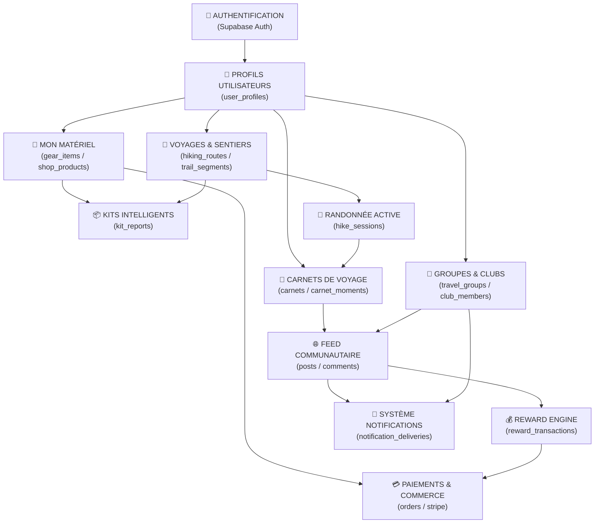

# 🔗 DÉPENDANCES SYSTÈME & MATRICE D'IMPACT

> [!abstract] **Visualisation des interdépendances architecturales**
> Comprendre comment les modifications sur un composant ou une table Supabase se répercutent sur l'ensemble de l'écosystème LKDV.

---

## 🗺️ Graphe Global des Dépendances

---

## 📊 Matrice d'Impact Détaillée

| Module Modifié | Modules Directement Impactés | Tables Concernées | Risque Majeur |
| :--- | :--- | :--- | :--- |
| **[[Auth]] / [[Profils]]** | Tous les modules (Session, RLS, Préférences) | `user_profiles`, `auth.users` | Blocage d'accès global, désynchronisation des droits |
| **[[Inventaire\|Mon Matériel]]** | [[Produits]], [[Kits]], [[Boutique]], [[Voyages]] | `gear_items`, `shop_products`, `kit_reports` | Erreur de calcul du poids de base, rupture de liens panier |
| **[[Cartes]] / [[Voyages]]** | [[Randonnée Active]], [[Carnets]], [[Configurateur]] | `hiking_routes`, `trail_segments`, `geo_*` | Crash du rendu cartographique WebGL, déviation GPS erronée |
| **[[Groupes]] / [[Clubs]]** | [[Commentaires]], [[Notifications]], [[Modération]] | `travel_groups`, `group_members`, `club_topics` | Élévation de privilèges RLS, fuite de messages privés |
| **[[Récompenses]]** | [[Profils]], [[Communauté]], [[Paiements]] | `reward_transactions`, `reward_accounts` | Vulnérabilité de double dépense, faux gains de points |
| **[[Notifications]]** | [[Groupes]], [[Clubs]], [[Alertes]] | `notification_deliveries`, `push_subscriptions` | Spamming email Resend, échec d'alertes de sécurité SOS |

---

## ⚡ Règles de Sécurité lors d'un Refactoring

1. **Règle de Cascade Supabase :** Ne jamais supprimer ou modifier une colonne sur `user_profiles` ou `gear_items` sans vérifier au préalable les contraintes de clés étrangères (`ON DELETE CASCADE` ou `ON DELETE RESTRICT`).
2. **Règle RLS :** Toute nouvelle table **doit** impérativement avoir `ENABLE ROW LEVEL SECURITY` activé dès sa création, avec des tests d'isolation anonyme (`anon`).
3. **Règle Cache Client :** Les modifications sur les sentiers et produits doivent invalider les tags de cache Next.js (`revalidatePath` ou `revalidateTag`) pour éviter de servir des données périmées.

---

> [!tip] **Pour continuer la navigation :**
> - Découvrir le schéma complet des tables : [[Tables]]
> - Explorer toutes les politiques de sécurité : [[RLS]]
> - Consulter l'ensemble des routes : [[Carte des routes]]
