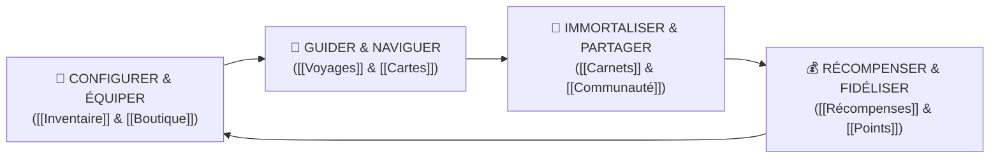

# 🌄 VISION & PHILOSOPHIE LKDV

> *"L'aventure sans friction : l'écosystème tout-en-un pour équiper, guider et immortaliser les expéditions des voyageurs du monde entier."*

---

## 🎯 Le Problème Fondamental

Aujourd'hui, un aventurier, randonneur ou trekkeur doit fragmenter son expérience entre 6 à 8 outils disparates :
1. **Planification & Cartes :** AllTrails, Komoot, Visorando, Google Maps.
2. **Gestion de l'équipement :** Tableurs Excel / Notion (LighterPack), calculs manuels de poids au gramme près.
3. **Achat & Matériel :** Decathlon, Hardloop, LeBonCoin, forums de troc spécialisés.
4. **Coordination de groupe :** Groupes WhatsApp, Tricount pour les frais partagés, sondages Doodle.
5. **Récits de voyage :** Polarsteps, Instagram, blogs personnels.
6. **Entraide & Expertise :** Forums d'alpinisme, groupes Facebook vieillissants.

Cette dispersion crée de la **friction mentale, des oublis dangereux sur le terrain, du surpoids dans le sac à dos** et une perte irrémédiable des souvenirs d'expédition.

---

## 💡 La Solution : LKDV (Le Kit du Voyageur)

LKDV réunit l'ensemble de cette chaîne de valeur au sein d'une plateforme unifiée, mobile-first, performante et esthétique.

### Les 4 Piliers Cardinaux

1. **Simplicité Radicale & Zéro Friction :**
   - Toutes les actions clés doivent être réalisables en moins de 3 taps sur mobile.
   - Les données circulent automatiquement (ex: un kit généré remplit l'inventaire, qui génère la checklist de voyage, qui alimente le carnet de terrain).
2. **Ultraléger & Éco-responsable :**
   - Calcul dynamique du poids de base (*Base Weight*).
   - Intégration native du matériel d'occasion certifié et reconditionné pour lutter contre la surconsommation.
3. **Sécurité & Fiabilité Terrain :**
   - Mode de suivi GPS hors-ligne, détection de déviation d'itinéraire, boutons SOS avec coordonnées exactes.
4. **Économie Circulaire & Créateur :**
   - Le *Reward Engine* rémunère équitablement les créateurs de carnets, les testeurs de matériel et les ambassadeurs de sentiers.

---

## 🏔️ Positionnement & Différenciateurs

| Fonctionnalité | LKDV | AllTrails / Komoot | Polarsteps | LighterPack |
| :--- | :---: | :---: | :---: | :---: |
| **Traces GPS & PostGIS Topo** | ✅ Oui | ✅ Oui | 🟡 Basique | ❌ Non |
| **Gestion Poids / Matériel Intégré** | ✅ **Natif (Mon Matériel)** | ❌ Non | ❌ Non | ✅ Oui (Brut) |
| **Achat / Occasion / Prêt en 1-clic** | ✅ **Natif** | ❌ Non | ❌ Non | ❌ Non |
| **Carnet Multimédia + IA Espèces** | ✅ **Natif** | ❌ Non | ✅ Oui | ❌ Non |
| **Coordination Groupe (Frais + Sondages)** | ✅ **Natif (Tricount intégré)** | ❌ Non | ❌ Non | ❌ Non |
| **Reward Engine (Gains réels)** | ✅ **Natif** | ❌ Non | ❌ Non | ❌ Non |

---

> [!tip] **Pour continuer la lecture :**
> - Découvrir la valeur pour chaque profil : [[Proposition de valeur]]
> - Explorer nos cibles d'utilisateurs : [[Personas]]
> - Voir la trajectoire de déploiement : [[Roadmap]]
