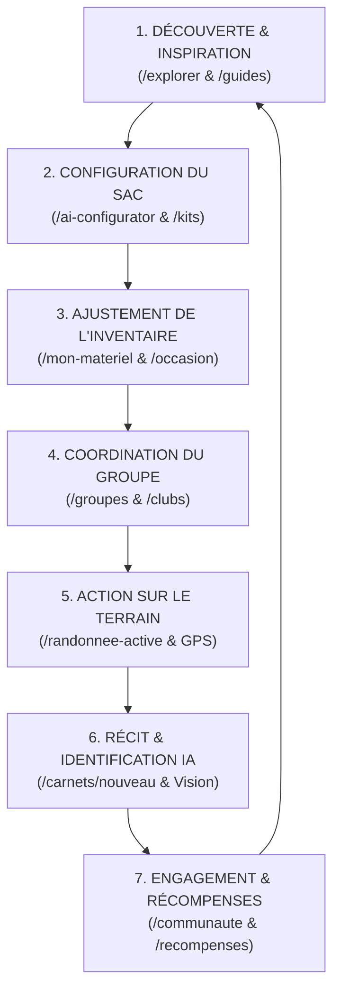

# 🚶 PARCOURS UTILISATEUR & FLUX VOYAGEUR

> [!abstract] **De la découverte de l'itinéraire jusqu'au partage de l'expédition**
> Une vue séquentielle et sans rupture du voyage d'un utilisateur à travers les modules interconnectés de LKDV.

---

## 🔄 Le Cycle Complet de l'Expédition (7 Étapes)

---

### Étape 1 : Découverte de l'Itinéraire (`/explorer`)
- L'utilisateur parcourt la carte interactive, applique des filtres par région, dénivelé ou durée.
- Il consulte la fiche détaillée du sentier : profil altimétrique, points d'eau, bivouacs autorisés.

### Étape 2 : Configuration Intelligente du Kit (`/ai-configurator`)
- L'utilisateur renseigne les paramètres de son trek (saison, altitude, autonomie en jours).
- L'IA génère un rapport de kit personnalisé (`kit_reports`) listant le matériel indispensable.

### Étape 3 : Gestion & Complétion de l'Inventaire (`/mon-materiel`)
- Les articles recommandés sont comparés à ce que l'utilisateur possède déjà dans son inventaire.
- En 1 clic, il ajoute les éléments manquants à sa liste d'achats (neuf, occasion ou location).

### Étape 4 : Coordination de l'Expédition (`/groupes/[groupId]`)
- Il crée un groupe, invite ses coéquipiers via un lien magique, lance un sondage pour la date et répartit le matériel lourd.

### Étape 5 : Navigation sur le Terrain (`/randonnee-active`)
- L'écran de suivi s'active en mode haute autonomie batterie (WebGL bridé, fond sombre, GPS réactif).
- L'application prévient par vibration en cas de déviation de plus de 50 mètres de la trace PostGIS.

### Étape 6 : Immortalisation dans le Carnet (`/carnets/nouveau`)
- Pendant et après la randonnée, les moments capturés (photos géotaggées) sont assemblés en timeline.
- L'IA identifie automatiquement les fleurs et rapaces photographiés (`/api/carnet/identify-species`).

### Étape 7 : Partage & Rémunération (`/communaute` & `/recompenses`)
- Le carnet est publié sur le feed. Les membres du club peuvent le liker, le commenter et s'en inspirer.
- Les interactions qualifiées créditent son compte [[Récompenses|Reward Engine]] en points et euros convertibles.

---

> [!tip] **Notes complémentaires :**
> - Découvrir toutes les fonctions : [[Fonctionnalités]]
> - Examiner les règles graphiques et interactions : [[Design System]]
