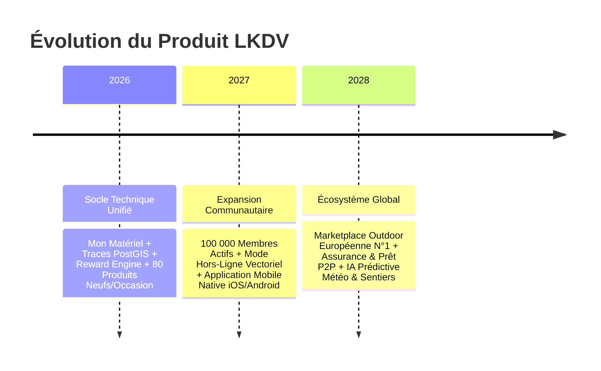

# 🎯 VISION PRODUIT LKDV

> [!abstract] **L'expérience outdoor augmentée et décomplexée**
> LKDV ambitionne de devenir la plateforme de référence pour l'aventure en autonomie en Europe et dans le monde, en supprimant la barrière technique et logistique de l'itinérance.

---

## 🏔️ Thèses & Convictions Fondamentales

1. **L'autonomie outdoor est le futur du tourisme :** Les voyageurs cherchent des expériences authentiques, proches de la nature, loin du tourisme de masse standardisé.
2. **Le sac à dos est un frein majeur :** 80% des abandons en randonnée ou en trek sont dus à un mauvais équipement (trop lourd, inadapté aux conditions météo, ou incomplet).
3. **La circularité est incontournable :** Le matériel de montagne coûte cher et dort 90% de l'année dans des placards. LKDV fluidifie le troc, la location et l'achat d'occasion certifié.
4. **La communauté est le meilleur guide :** Les sentiers vivants sont documentés par ceux qui les parcourent aujourd'hui, avec des photos réelles, des alertes météo et des retours honnêtes.

---

## 🎯 Objectifs Stratégiques à 3 Ans

---

> [!tip] **Pour approfondir :**
> - Découvrir la valeur concrète apportée : [[Proposition de valeur]]
> - Explorer nos cibles : [[Personas]]
> - Voir les fonctionnalités associées : [[Fonctionnalités]]
