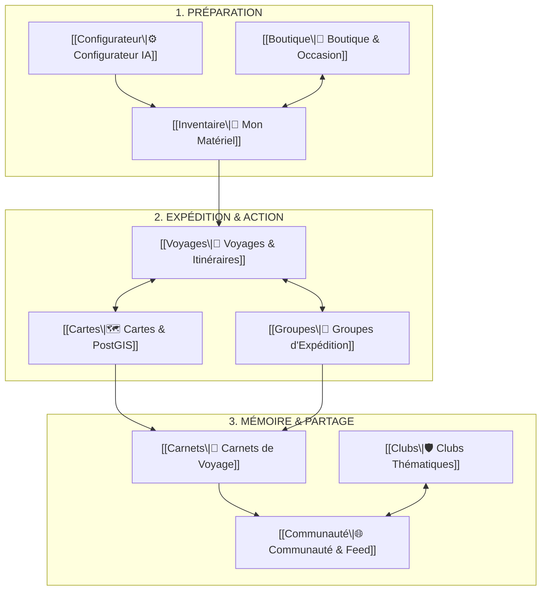

# 🧩 VUE D'ENSEMBLE DE L'ÉCOSYSTÈME LKDV

> [!abstract] **Les 10 Piliers Connectés de l'Expérience Voyageur**
> L'écosystème LKDV fonctionne comme un réseau symbiotique où chaque action dans un module enrichit automatiquement les autres.

---

## 🗺️ Schéma des Relations Inter-Modules

---

## 📋 Les 10 Fiches Détaillées du Système

| Module | Rôle dans l'Écosystème | Statut | Accès à la Fiche Complète |
| :--- | :--- | :---: | :--- |
| **1. Voyages & Sentiers** | Recherche, planification et guidage terrain sur 1 100+ itinéraires | 🟢 Fonctionnel | [[Voyages]] |
| **2. Configurateur IA** | Dimensionnement intelligent du sac selon météo, durée et dénivelé | 🟢 Fonctionnel | [[Configurateur]] |
| **3. Mon Matériel (Inventaire)** | Gestion unifiée du matériel possédé, calcul de poids et alertes usure | 🟢 Fonctionnel | [[Inventaire]] |
| **4. Carnets de Voyage** | Récits d'itinérance multimédias avec géolocalisation et vision IA | 🟢 Fonctionnel | [[Carnets]] |
| **5. Groupes d'Expédition** | Coordination de trek, partage de frais Tricount et sondages | 🟢 Fonctionnel | [[Groupes]] |
| **6. Clubs Thématiques** | Micro-communautés ciblées (alpinisme, bikepacking, ultra-trail) | 🟢 Fonctionnel | [[Clubs]] |
| **7. Feed Communautaire** | Partage d'expériences, interactions sociales et entraide | 🟢 Fonctionnel | [[Communauté]] |
| **8. Cartes & Géodonnées** | Moteur PostGIS, couches topographiques et alertes déviation | 🟢 Fonctionnel | [[Cartes]] |
| **9. Boutique & Matériel** | Catalogue 80+ articles, marketplace d'occasion, affiliation, Stripe | 🟢 Fonctionnel | [[Boutique]] |
| **10. Moteur de Récompenses** | Monétisation équitable, calcul de points et commissions d'apporteur | 🟢 Fonctionnel | [[Récompenses]] |

---

> [!tip] **Pour explorer les modules :**
> Ouvrez l'une des fiches ci-dessus pour découvrir l'anatomie complète du module (UX, composants, tables SQL, RLS, APIs, bugs et roadmap).
