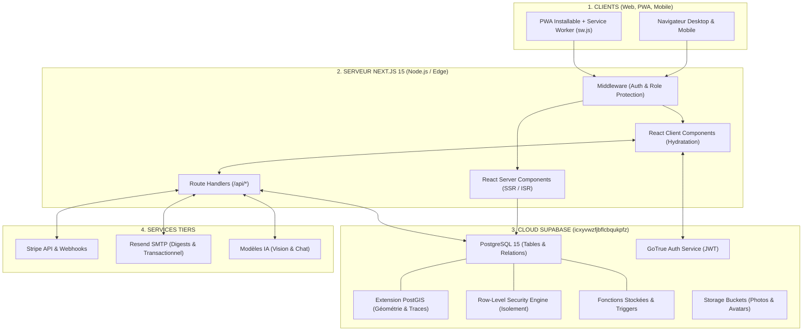

# 🏗️ ARCHITECTURE GLOBALE DU SYSTÈME LKDV

> [!abstract] **Stack Moderne, Modulaire, Performante et Éco-conçue**
> L'architecture de LKDV repose sur le triptyque Next.js 15 (App Router) / React 19, Supabase (PostgreSQL + PostGIS) et Stripe pour les transactions, garantissant une montée en charge fluide et un coût d'infrastructure minimal.

---

## 🗺️ Diagramme d'Architecture

---

## 🛠️ Composants Clés de la Stack

| Brique | Technologie | Version | Rôle Principal |
| :--- | :--- | :---: | :--- |
| **Framework Web** | Next.js (App Router) | 15.x | Rendu hybride SSR/ISR, routing fichier, API route handlers |
| **Bibliothèque UI** | React | 19.x | Composants réactifs, Hooks, Suspense, Concurrent Mode |
| **Langage** | TypeScript | 5.x | Typage strict à 100%, zéro `any` toléré en production |
| **Styles** | TailwindCSS | 3.4 | Utilitaires CSS atomiques, thémage sur-mesure |
| **Animations** | Framer Motion | 11.x | Micro-interactions et transitions de route à 60fps |
| **Base de Données** | PostgreSQL + PostGIS | 15.x | Données relationnelles, calculs géospatiaux et grand livre |
| **Authentification** | Supabase Auth (GoTrue) | — | JWT, Sessions sécurisées, Magic Links, OAuth |
| **Paiements** | Stripe Elements & Webhook | — | Checkout e-commerce et gestion des abonnements |
| **Cartographie** | Leaflet / Mapbox GL | — | Rendu cartographique vectoriel et raster |
| **3D & Globe** | Three.js / WebGL | — | Rendu planétaire optimisé basse consommation |

---

> [!tip] **Pour continuer la lecture :**
> - Découvrir l'organisation du Frontend : [[Frontend]]
> - Découvrir l'organisation du Backend : [[Backend]]
> - Consulter l'inventaire des routes API : [[API]]
