# ⚙️ ARCHITECTURE BACKEND & MOTEURS SERVEUR

> [!abstract] **Un Backend Hybride : Next.js API Handlers + Supabase PostgreSQL Engine**
> Le backend de LKDV combine la puissance du moteur relationnel PostgreSQL (RLS, Triggers, PostGIS) avec des fonctions Edge / Serverless légères Next.js pour les intégrations tierces (Stripe, Resend, Vision IA).

---

## 🏗️ Répartition des Rôles

```mermaid
flowchart LR
    subgraph NEXTJS_ROUTES ["Next.js Route Handlers (/api/*)"]
        CHK["/api/checkout (Calculs de prix serveur)"]
        STR["/api/stripe/webhook (Idempotence & Commandes)"]
        REP["/api/kit-report/* (Génération IA)"]
        NOT["/api/notifications/* (Push & VAPID)"]
        REW["/api/rewards/* (Retraits & Validation)"]
    end

    subgraph POSTGRES_ENGINE ["Supabase PostgreSQL Engine"]
        RLS["Contrôle d'accès RLS temps réel"]
        TRIG["Triggers automatiques (Compteurs, Notifs)"]
        POSTGIS["Calculs spatiaux ST_DWithin / Traces"]
        LEDGER["Grand livre immuable Reward Engine"]
    end

    NEXTJS_ROUTES <--> POSTGRES_ENGINE
```

---

## 🔒 Règles de Sécurité Backend

1. **Aucune Clé Secrète dans le Client :** La clé `SUPABASE_SERVICE_ROLE_KEY` et la clé `STRIPE_SECRET_KEY` ne sont jamais exposées au bundle navigateur.
2. **Idempotence des Webhooks :** Tout événement Stripe est vérifié par sa signature cryptographique et enregistré avec son `event.id` pour empêcher les doubles exécutions.
3. **Fonctions avec Search Path Fixé :** Toutes les fonctions PL/pgSQL utilisent explicitement `SET search_path = public, pg_temp;` pour prévenir les attaques par détournement de schéma.

---

> [!tip] **Pour continuer la lecture :**
> - Consulter toutes les routes API : [[API]]
> - Découvrir le schéma de base de données : [[Tables]]
> - Explorer l'authentification : [[Authentification]]
