# 🗄️ ARCHITECTURE BDD & MODÈLE SUPABASE

> [!abstract] **PostgreSQL 15 + PostGIS : Le Cœur Transactionnel et Géospatial de LKDV**
> Hébergée sur l'instance Supabase `icxyvwzfjbflcbqukpfz` (region `eu-west-3`), la base de données regroupe 48+ tables métier réparties en 7 grands domaines logiques.

---

## 🏛️ Les 7 Domaines Métier de la Base

```mermaid
graph TD
    subgraph DOMAINE_1 ["1. Identité & Profils"]
        U_PROF["user_profiles"]
        U_BADGE["user_badges"]
        U_PREF["user_preferences"]
    end

    subgraph DOMAINE_2 ["2. Sentiers & Géodonnées (PostGIS)"]
        H_ROUTES["hiking_routes"]
        T_SEGS["trail_segments"]
        T_POIS["trail_pois"]
        GEO_NAT["geo_countries / geo_places"]
    end

    subgraph DOMAINE_3 ["3. Équipement & Matériel"]
        G_ITEMS["gear_items (Mon Matériel)"]
        S_PRODS["shop_products"]
        K_REPS["kit_reports"]
        OCC_LIST["occasion_listings"]
    end

    subgraph DOMAINE_4 ["4. Carnets & Sessions"]
        CARN["carnets"]
        C_MOM["carnet_moments"]
        H_SESS["hike_sessions"]
    end

    subgraph DOMAINE_5 ["5. Communauté, Groupes & Clubs"]
        T_GROUPS["travel_groups"]
        G_MEMBS["group_members / club_members"]
        G_EXP["group_expenses"]
        POSTS["posts / comments / likes"]
    end

    subgraph DOMAINE_6 ["6. Économie & Récompenses"]
        R_ACCS["reward_accounts"]
        R_TRANS["reward_transactions (Ledger)"]
        R_WITH["reward_withdrawals"]
        ORDERS["orders / order_items"]
    end

    subgraph DOMAINE_7 ["7. Notifications & File"]
        N_DELIV["notification_deliveries"]
        P_SUBS["push_subscriptions"]
    end

    U_PROF --> H_ROUTES
    U_PROF --> G_ITEMS
    U_PROF --> CARN
    U_PROF --> T_GROUPS
    U_PROF --> R_ACCS
    H_ROUTES --> T_SEGS
    G_ITEMS --> S_PRODS
```

---

> [!tip] **Pour continuer l'exploration :**
> - Consulter le détail de toutes les tables : [[Tables]]
> - Examiner les clés étrangères et schémas relationnels : [[Relations]]
> - Découvrir les politiques de sécurité : [[RLS]]
> - Explorer les fonctions et triggers : [[Functions]], [[Triggers]]
