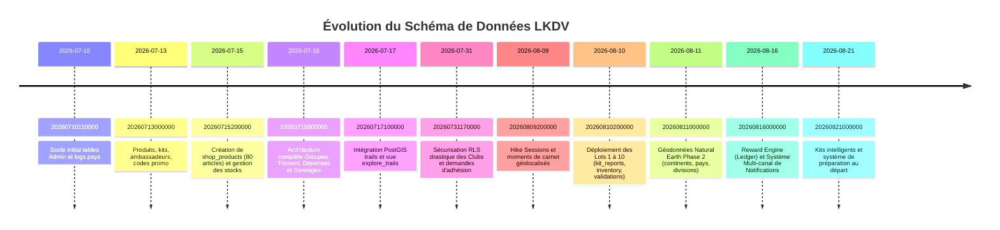

# 📜 HISTORIQUE DES MIGRATIONS SUPABASE LKDV

> [!abstract] **86+ Migrations Appliquées et Synchronisées sur `icxyvwzfjbflcbqukpfz`**
> Chaque étape de l'évolution de la base de données est versionnée et reproductible via Supabase CLI (`npx supabase db push`).

---

## 📅 Chronologie des Lots Majeurs

---

> [!tip] **Notes complémentaires :**
> - Découvrir le schéma actuel : [[Architecture BDD]]
> - Examiner les règles d'intégrité : [[Relations]]
