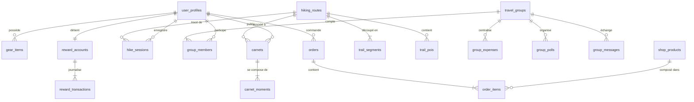

# 🔗 RELATIONS & CLÉS ÉTRANGÈRES BDD LKDV

> [!abstract] **Le réseau des clés étrangères et contraintes d'intégrité**

---

## 🗺️ Diagramme Entité-Relation (ERD)

---

## 🛡️ Règles de Cascade & Intégrité

1. **Suppression d'un utilisateur (`auth.users`) :**
   - `CASCADE` sur `user_profiles`, `user_preferences`, `reward_accounts`.
   - `SET NULL` sur les auteurs de sentiers et produits pour préserver le catalogue public.
2. **Suppression d'un carnet (`carnets`) :**
   - `CASCADE` sur `carnet_moments` et nettoyage automatique des fichiers liés dans Supabase Storage.
3. **Suppression d'un groupe (`travel_groups`) :**
   - `CASCADE` sur `group_members`, `group_expenses`, `group_polls` et `group_messages`.

---

> [!tip] **Notes complémentaires :**
> - Découvrir le contrôle d'accès ligne par ligne : [[RLS]]
> - Explorer les déclencheurs automatiques : [[Triggers]]
