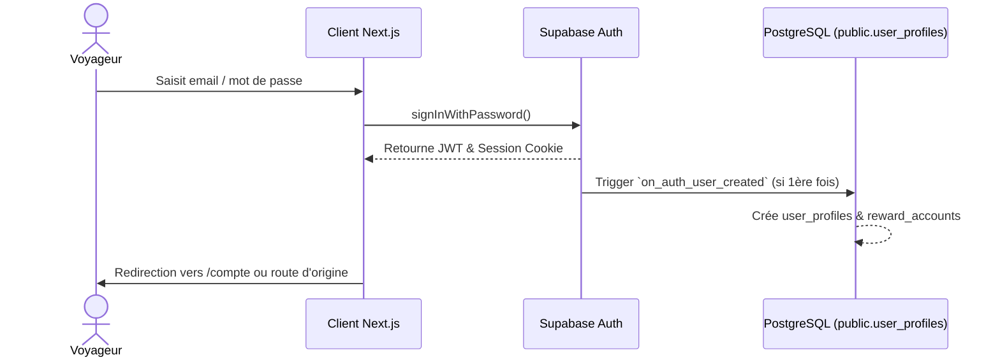

# 🔐 SYSTÈME — AUTHENTIFICATION & GESTION DES COMPTES

> [!abstract] **Gestion unifiée des identités voyageur**
> Le système d'authentification s'appuie sur Supabase Auth avec Magic Links par email, mots de passe chiffrés et sessions JWT sécurisées.

---

## ⚡ Flux d'Authentification

---

> [!tip] **Pour continuer la lecture :**
> - Découvrir le modèle de profil : [[Profils]]
> - Explorer la matrice des permissions : [[Permissions]]
