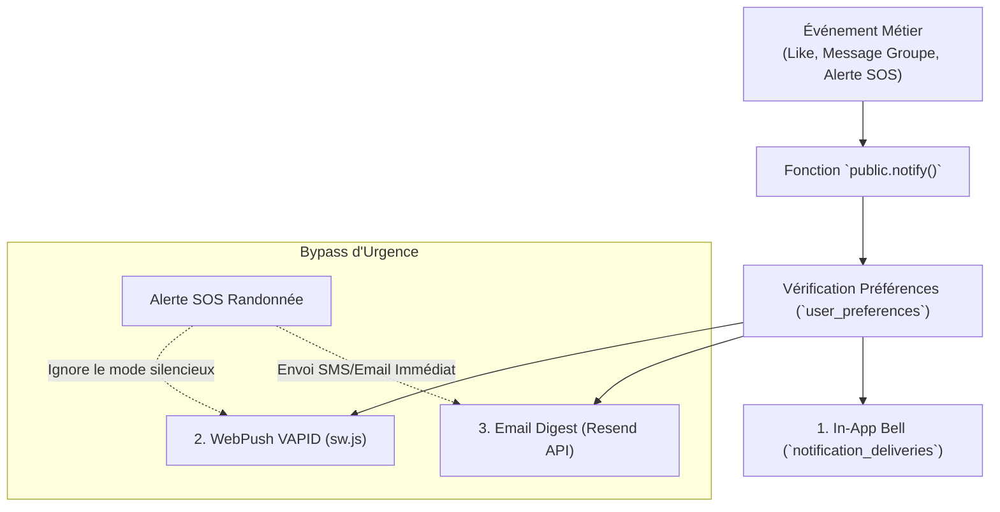

# 🔔 SYSTÈME — NOTIFICATIONS MULTI-CANAUX & WEBPUSH

> [!abstract] **Diffusion d'alertes in-app, notifications push et digests email**
> LKDV intègre une file de messages asynchrone sécurisée par RLS, un Service Worker local (`/public/sw.js`) pour les alertes push navigateur, et un moteur de regroupement pour prévenir la sur-sollicitation.

---

## ⚡ Canaux de Diffusion & Priorités

---

## ⚙️ Regroupement Intelligent (Clustering)

Pour éviter de spammer l'utilisateur lors de discussions animées dans un groupe d'expédition :
- Les messages de chat d'un même groupe sont agrégés par tranche de **15 minutes**.
- L'utilisateur ne reçoit qu'une seule notification : *"Sarah et 3 autres personnes ont envoyé 8 messages dans [Trek Écosse 2026]"*.

---

> [!tip] **Notes complémentaires :**
> - Découvrir le moteur de recherche : [[Recherche]]
> - Découvrir les récompenses : [[Récompenses]]
