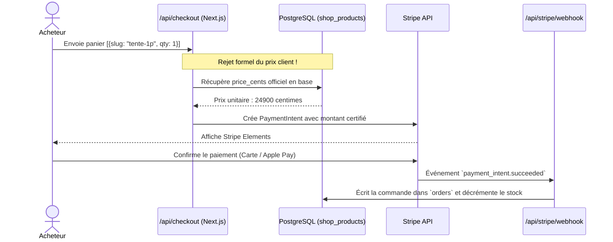

# 💳 SYSTÈME — PAIEMENTS SÉCURISÉS & STRIPE

> [!abstract] **Le tunnel d'achat certifié et sécurisé côté serveur**

---

## ⚡ Flux de Checkout Sécurisé

---

> [!tip] **Pour continuer la lecture :**
> - Découvrir les permissions système : [[Permissions]]
> - Explorer la gestion des produits : [[07 — 🛒 COMMERCE/Produits\|Produits]]
