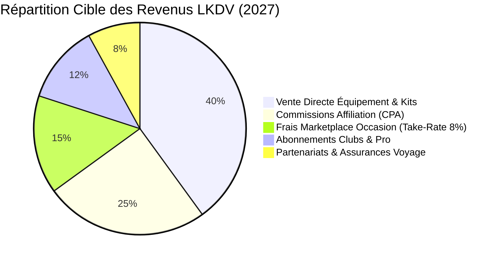

# 💰 BUSINESS — MODÈLE ÉCONOMIQUE & PILIERS DE REVENUS

> [!abstract] **Un modèle d'affaires diversifié, scalable et éthique**

---

## 🏛️ Les 5 Piliers de Monétisation

---

## 📊 Détail des Flux Financiers

1. **Vente Directe & Kits :** Marge brute de 30% à 45% sur les 80+ références sélectionnées (neuf).
2. **Affiliation E-commerce :** Rémunération de 5% à 10% sur les paniers redirigés vers nos partenaires (Hardloop, Ekosport, Decathlon).
3. **Take-Rate Seconde Main :** Commission de 8% prélevée sur les transactions d'occasion pour couvrir la garantie acheteur et les frais Stripe.
4. **Offre LKDV Pro :** Abonnement mensuel/annuel pour les guides de haute montagne et marques (outils de création de stages, visibilité club premium).

---

> [!tip] **Pour continuer la lecture :**
> - Découvrir la politique tarifaire : [[Monétisation]]
> - Explorer l'économie créateur : [[Points & récompenses]]
> - Examiner les métriques : [[KPIs]]
