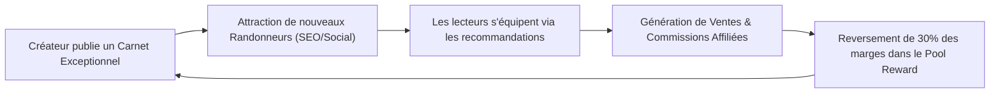

# 💎 BUSINESS — ÉCONOMIE CRÉATEUR & RETOUR SUR INVESTISSEMENT (ROI)

> [!abstract] **Comment le Reward Engine transforme l'engagement en croissance organique**

---

## 🔄 La Boucle de Rétention & Viralité Économique

---

## 📈 Règle d'Auto-Balancement Financier

Pour garantir que LKDV ne distribue jamais plus de récompenses qu'elle n'en génère :
- Le pool mensuel distribuable est égal à **exactement 30% de la marge nette e-commerce & affiliation** du mois précédent.
- La valeur du point est ajustée dynamiquement : $\text{Valeur du Point} = \frac{\text{Pool Distribuable (€)}}{\text{Total Points Qualifiés Réclamés}}$.

---

> [!tip] **Notes complémentaires :**
> - Découvrir le fonctionnement technique du grand livre : [[06 — 🔗 SYSTÈMES/Récompenses\|Système Récompenses]]
> - Explorer les KPIs : [[KPIs]]
