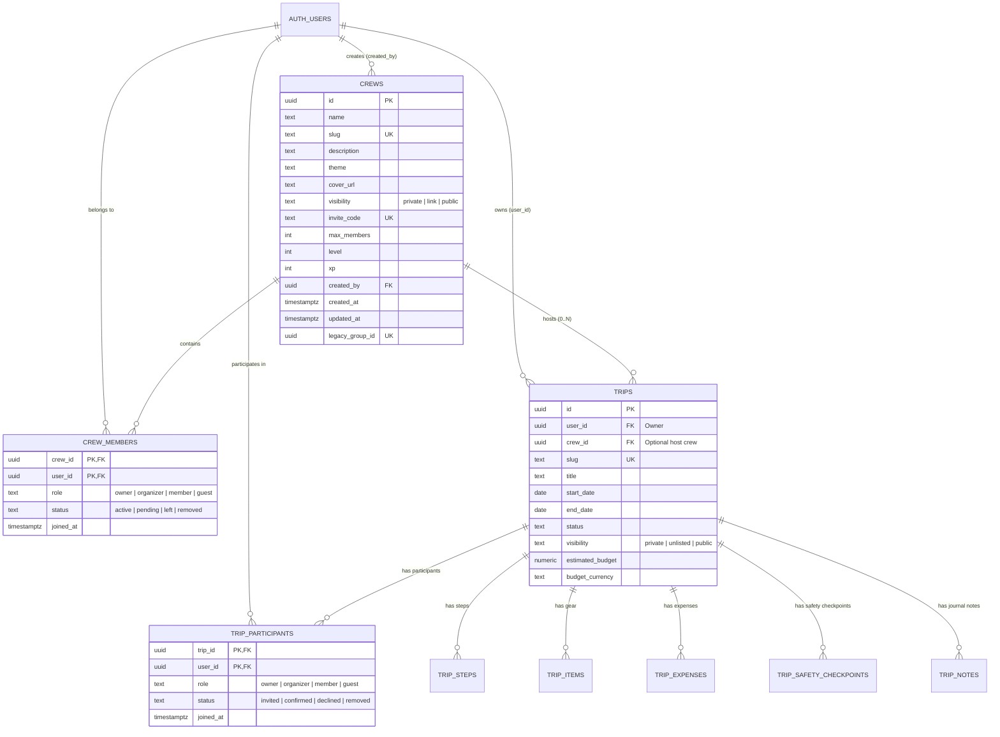

# Architecture & Modèle de Données Unifié LKDV (Phase 3)
Version : 1.0.0 · Date : 2026-09-07
Dépôt : `TFaraciColbert59/kitduvoyageur_1783951966810`
Branche : `chantier/u3-modele-donnees-rls`

---

## 1. Vision & Décision d'Architecture

Historiquement, LKDV disposait de deux modèles distincts et concurrents pour la collaboration :
1. **`travel_groups` & `group_members`** : Orienté communauté et réseaux sociaux, avec notion de groupe permanent, niveau/XP, et rôles `organizer`, `co_organizer`, `member`, `observer`.
2. **`trips` & `trip_collaborators`** : Orienté itinéraire et expédition ponctuelle, avec rôles `owner`, `editor`, `viewer`.

### La Décision Fondatrice (ADR Unification)
Nous unifions ces deux mondes sous une architecture en poupées russes cohérente et découplée :
- **Équipage (`crews`)** : Le collectif permanent ou semi-permanent (cercle d'amis, club, famille). Un équipage possède des membres (`crew_members`), un niveau, et peut organiser 0 à N voyages.
- **Voyage (`trips`)** : L'expédition concrète dans le temps et l'espace (dates, itinéraire, matériel, étapes). Un voyage peut être rattaché à un équipage (`crew_id`), ou être un voyage autonome/solo (`crew_id IS NULL`).
- **Participant au voyage (`trip_participants`)** : La présence active d'un utilisateur sur un voyage précis. Être membre de l'équipage n'oblige pas à être participant sur tous les voyages de l'équipage (ex: voyage d'alpinisme réservé à 3 membres d'un équipage de 10).
- **Rôles unifiés canoniques** : Un seul vocabulaire dans tout le modèle de données :
  - `owner` (Propriétaire / Créateur)
  - `organizer` (Organisateur / Co-organisateur)
  - `member` (Membre actif)
  - `guest` (Invité / Observateur en lecture seule)

---

## 2. Diagramme des Relations (Mermaid)

---

## 3. Règles de Cardinalité & Invariants Métier

1. **Autonomie du Voyage** :
   - Un voyage peut exister **sans équipage** (`trips.crew_id IS NULL`). C'est le cas typique des randonnées solo ou créées avant constitution d'un collectif.
   - Si `trips.crew_id` est renseigné, le propriétaire du voyage doit obligatoirement être au moins `organizer` ou `owner` de l'équipage.

2. **Équipage sans Voyage** :
   - Un équipage peut exister sans aucun voyage actif (`COUNT(trips) = 0`).

3. **Indépendance des Participations** :
   - Être membre d'un équipage n'implique pas automatiquement `status = 'confirmed'` sur un voyage. Les membres de l'équipage peuvent être invités (`'invited'`) ou s'inscrire individuellement.
   - Tout participant avec `status = 'confirmed'` accède aux ressources du voyage (itinéraire, matériel, budget partagé).

4. **Statuts des Membres** :
   - Un utilisateur avec `status = 'left'` ou `'removed'` ne possède plus aucun droit d'accès aux données privées de l'équipage ou du voyage.
   - Un utilisateur avec `status = 'pending'` ou `'invited'` peut uniquement lire les métadonnées publiques nécessaires à l'acceptation de l'invitation.

---

## 4. Matrice de Sécurité RLS (`lkv_can`)

La fonction PostgreSQL `lkv_can(user_id uuid, resource text, resource_id uuid, action text) RETURNS boolean` régit **toutes** les politiques de sécurité (RLS).

| Ressource | Rôle Utilisateur | SELECT | INSERT | UPDATE | DELETE |
|---|---|:---:|:---:|:---:|:---:|
| **`crews`** | `owner` | ✅ | ✅ | ✅ | ✅ |
| | `organizer` | ✅ | ❌ | ✅ (métadonnées) | ❌ |
| | `member` | ✅ | ❌ | ❌ | ❌ |
| | `guest` (actif) | ✅ | ❌ | ❌ | ❌ |
| | Membre `pending` / `left` | ❌ (sauf si crew `public`/`link`) | ❌ | ❌ | ❌ |
| | Non-membre authentifié | ❌ (sauf si crew `public`) | ✅ (création) | ❌ | ❌ |
| | Anonyme (`auth.uid() IS NULL`) | ❌ (sauf si crew `public`) | ❌ | ❌ | ❌ |
| **`crew_members`** | `owner` | ✅ | ✅ (inviter) | ✅ (rôles) | ✅ (expulser) |
| | `organizer` | ✅ | ✅ (inviter) | ✅ (`member`/`guest`) | ❌ (sauf départ) |
| | `member` | ✅ | ❌ | ❌ | ✅ (départ soi-même) |
| | `guest` | ✅ | ❌ | ❌ | ✅ (départ soi-même) |
| | Non-membre | ❌ | ❌ (via accept invite) | ❌ | ❌ |
| **`trips`** | `owner` (créateur) | ✅ | ✅ | ✅ | ✅ |
| | `organizer` (voyage) | ✅ | ❌ | ✅ | ❌ |
| | `member` (participant confirmé) | ✅ | ❌ | ❌ (sauf ses items) | ❌ |
| | `guest` (participant confirmé) | ✅ | ❌ | ❌ | ❌ |
| | Membre de l'équipage hôte (non participant) | ✅ (si trip non private) | ❌ | ❌ | ❌ |
| | Non-participant | ❌ (sauf si trip `public`) | ❌ | ❌ | ❌ |
| | Anonyme | ❌ (sauf si trip `public`) | ❌ | ❌ | ❌ |
| **`trip_participants`** | `owner` du voyage | ✅ | ✅ (inviter) | ✅ (rôles) | ✅ (retirer) |
| | `organizer` du voyage | ✅ | ✅ (inviter) | ✅ (`member`/`guest`) | ✅ (`member`/`guest`) |
| | `member` confirmé | ✅ | ❌ | ❌ | ✅ (quitter voyage) |
| | `guest` confirmé | ✅ | ❌ | ❌ | ✅ (quitter voyage) |
| | Non-participant | ❌ | ❌ | ❌ | ❌ |

---

## 5. Rétrocompatibilité & Vues de Transition

Pour garantir zéro régression et permettre un déploiement continu sans interruption de service :
1. **`travel_groups_legacy`** : Vue SQL exposant les colonnes exactes de `travel_groups` pointant sur `crews`.
2. **`trip_collaborators_legacy`** : Vue SQL exposant `trip_collaborators` pointant sur `trip_participants`.
3. **`legacy_group_id`** : Colonne d'indexation conservée dans `crews` permettant le mapping bidirectionnel instantané des anciennes requêtes et URLs `/groupes/[groupId]`.

---

## 6. Procédure de Migration (`up` & `down`)

- La migration `up` crée les tables, les index, les fonctions RLS, et insère les données existantes de manière strictement **idempotente** (`ON CONFLICT DO NOTHING`).
- La migration `down` restaure l'état exact antérieur de manière transactionnelle (`BEGIN ... COMMIT`).
- Des tests automatisés Vitest valident la cohérence du schéma, la matrice RLS et la logique de mapping.
