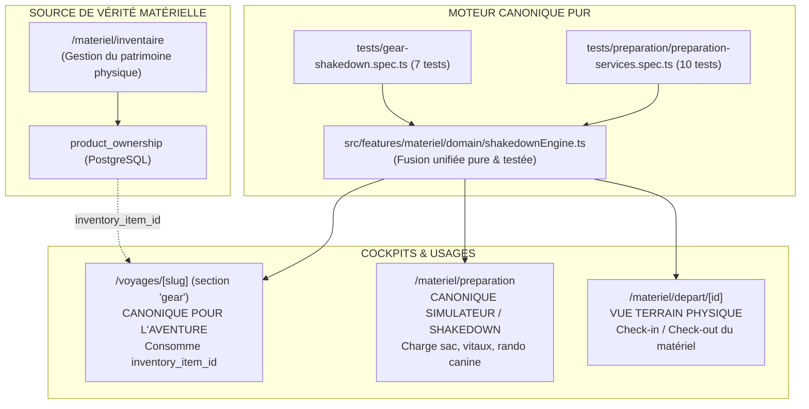

# Z1 — ARBITRAGES ARCHITECTURAUX DU MODULE MATÉRIEL & HUB VOYAGES

- **Date d'arbitrage** : 8 septembre 2026
- **Branche** : `chantier/z-materiel-hub`
- **Auteur / Arbitre** : Antigravity & Tony
- **Point de référence** : Inventaire et cartographie `docs/Z_INVENTAIRE_MATERIEL.md` (commit `7bbcadee` + rectificatifs)
- **Règle absolue de phase** : Zéro modification de code applicatif en Z1. Décisions d'architecture écrites, motivées, et fichiers gagnants formellement nommés avant toute action d'élagage ou de fusion en Z2.

---

## Synthèse exécutive des arbitrages Z1



| Domaine | Problématique initiale | Décision / Gagnant désigné | Fichier gagnant cible |
| :--- | :--- | :--- | :--- |
| **1. Moteur canonique** | Triangle `shakedownEngine` (gear) vs `gearGapEngine` (prep) vs calculs `depart` | **Fusion unifiée au profit d'un moteur pur neutre** réunissant le sur-ensemble des 2 moteurs, zéro dépendance UI/store | `src/features/materiel/domain/shakedownEngine.ts` |
| **2. Composants orphelins** | 4 composants UI orphelins (28 ko Git) générant 82 violations Y-D80 | **Élagage complet en Z2**, maintien des 7 tests unitaires via adaptation des imports | Supprimés en Z2 (`features/gear/components/*`) |
| **3. Chevauchement cockpits** | 3 écrans préparent un sac (`DepartCockpit`, `PreparationCockpit`, `TripKitView`) | **Répartition stricte des responsabilités** : Hub = Aventure/Exécution ; Prep = Simulation/Audit ; Inventaire = Patrimoine | Hub = Canonique Aventure ; Prep = Simulateur ; Depart = Vue Check-in/out |
| **4. Contrainte FK SQL** | `inventory_item_id` est un UUID nu sans contrainte `REFERENCES` | **Signalement de vulnérabilité relationnelle**, mitigation applicative immédiate et migration DDL planifiée | Migration corrective ciblée en Z4/Z5 |

---

## Décision 1 : Le Moteur de Shakedown & d'Analyse de Sac Canonique

### 1.1. Analyse comparative fonction par fonction

L'audit Z0 a révélé la coexistence de deux moteurs :
1. `src/features/gear/services/shakedownEngine.ts` (6 532 octets, 7 tests unitaires dans `tests/gear-shakedown.spec.ts`).
2. `src/features/preparation/services/gearGapEngine.ts` (8 269 octets, couplé à `weightCalculator.ts`, 10 tests dans `tests/preparation/preparation-services.spec.ts`).

| Fonctionnalité | `shakedownEngine.ts` (gear) | `gearGapEngine.ts` + `weightCalculator.ts` (prep) | Évaluation / Cas disjoints | Gagnant retenu |
| :--- | :--- | :--- | :--- | :--- |
| **Calcul Base Weight, Worn, Consumables** | `calculateWeightBreakdown(items: GearItem[])`<br/>Calcule Base, Worn, Consumables, Total Pack, Total Weight et `mulCategory` ('ultralight' < 4.5kg, 'light' < 9kg, 'traditional'). | `calculateWeightBreakdown(items: GearItem[])`<br/>Même arithmétique rigoureuse avec guard `Math.max(1, item.quantity \|\| 1)` et repli `(item.weightGrams \|\| 0)`. | **Identiques sur le fond.** La version `weightCalculator` est plus robuste face aux valeurs `null`/`undefined`. | Version robuste avec guard `Math.max` |
| **Catégorisation MUL** | Seuils : 4,5 kg (ultralight) et 9,0 kg (light). | Mêmes seuils (4,5 kg et 9,0 kg). | **Identique.** | Reconduite |
| **Détection des doublons** | `identifyDuplicates(items: GearItem[])`<br/>Normalisation `toLowerCase().trim()`, détection si `qty > 1`. | `identifyDuplicates(items: GearItem[])`<br/>Exactement le même algorithme et même message : `Doublon détecté : ${qty}x "${originalName}" dans le sac.`. | **Identique.** | Algorithme standardisé |
| **Détection des vitaux obligatoires** | `identifyMissingVitals(items: GearItem[])`<br/>5 vitaux : secours, couverture, frontale, filtre, sifflet (`REQUIRED_VITALS`). Message : `Équipement vital manquant : ${label}`. | `identifyMissingVitals(items: GearItem[])`<br/>7 items (`ESSENTIAL_GEAR_CHECKLIST`), filtre sur `priority === 'vital'`. Message : `Équipement vital manquant dans le sac : ${name}`. | **Disjoint.** `tests/gear-shakedown.spec.ts` attend les mots-clés ('secours', 'filtre') et `>= 4` manquants. `gearGapEngine` gère aussi couteau et briquet en recommandés. | Sur-ensemble unifié avec labels rétro-compatibles |
| **Articles lourds & Seuils** | `identifyHeavyItems(items: GearItem[])`<br/>5 catégories : shelter (1600g), sleep (1200g), cook (450g), clothing (650g), tech (400g). | `identifyHeavyItems(items: GearItem[])`<br/>**9 catégories** : ajoute water (350g), safety (350g), navigation (250g), misc (500g). | **`gearGapEngine` est strictement supérieur** (couverture plus fine de l'équipement moderne). | 9 catégories de seuils |
| **Recommandations d'allègement** | `generateShakedownReport`<br/>Génère alternatives (tente 950g, duvet 620g) pour items $\ge 1.8$kg et $\ge 1.2$kg. | `generateShakedownReport`<br/>Même logique avec seuil duvet abaissé à $\ge 1.1$kg. | **Identique à 100g près.** | Seuil affiné 1.1kg |
| **Gear Gaps & Recommandations Shop** | *Non présent* | `detectGearGaps(items: GearItem[])`<br/>Identifie les manques et suggère des produits précis LKDV avec prix, poids et slug boutique. | **Capacité exclusive de `gearGapEngine`.** Indispensable pour la conversion e-commerce et le conseil utilisateur. | Conservé |
| **Calculs de charge canine & équipe** | *Non présent* | `loadDistribution.ts`<br/>Portage max chien (15% du poids vif), rations eau/croquettes, équilibrage participants. | **Capacité exclusive de `features/preparation`.** Doit rester disponible sans alourdir le moteur de base. | Conservé dans son module dédié |

### 1.2. Décision architecturale formelle

> **DÉCISION 1.1 — LE FICHIER GAGNANT :**
> Le moteur canonique unique sera hébergé dans :
> **`src/features/materiel/domain/shakedownEngine.ts`**
>
> Ce choix d'emplacement s'impose car le dossier `domain/` de `src/features/materiel/` est déjà réservé aux calculs purs sans état ni rendu React (où vit déjà `departCalculations.ts`). Il est universellement importable par :
> 1. Le Hub Voyages (`src/features/trips/components/TripKitView.tsx` et son moteur de kit).
> 2. Le cockpit de préparation rando (`src/features/preparation/services/`).
> 3. Le cockpit départ matériel (`src/features/materiel/components/depart/`).

### 1.3. Protocole de fusion et garantie de zéro régression de tests

Le moteur canonique `src/features/materiel/domain/shakedownEngine.ts` sera une **fusion unifiée pure** :
- **Intrants** : fonctions pures sans effet de bord, prenant en entrée un tableau `GearItem[]` générique (compatible avec les items de voyage, d'inventaire ou de préparation).
- **Rétro-compatibilité stricte** : Les exports nommés de `shakedownEngine.ts` (`calculateWeightBreakdown`, `identifyDuplicates`, `identifyMissingVitals`, `identifyHeavyItems`, `generateShakedownReport`, `HEAVY_THRESHOLDS`, `REQUIRED_VITALS`) seront préservés à l'identique pour que [`tests/gear-shakedown.spec.ts`](file:///c:/Users/Tony/Downloads/LKDV/kitduvoyageur_1783951966810/tests/gear-shakedown.spec.ts) passe sans modifier un seul test assertionnel.
- **Support des Gear Gaps** : Intégration de `detectGearGaps` et `ESSENTIAL_GEAR_CHECKLIST`.
- **Bilan de tests** :
  - `tests/gear-shakedown.spec.ts` : **7 tests maintenus**.
  - `tests/preparation/preparation-services.spec.ts` : **10 tests maintenus**.
  - **Total garanti : 17 tests unitaires passants** (compteur global de la suite maintenu à $\ge 1049$).

---

## Décision 2 : Sort des Quatre Composants UI Orphelins de `src/features/gear`

### 2.1. Constat objectif issu de Z0
Les quatre composants UI suivants :
1. `src/features/gear/components/GearManager.tsx` (9 674 octets Git)
2. `src/features/gear/components/GearChecklist.tsx` (8 622 octets Git)
3. `src/features/gear/components/ShakedownAuditView.tsx` (7 828 octets Git)
4. `src/features/gear/components/WeightSummaryCard.tsx` (5 764 octets Git)

- **Nombre d'imports dans l'application (`src/`)** : **0** (prouvé par grep exhaustif en Z0).
- **Nombre de tests de composants UI** : **0** (aucun test Playwright ni Vitest ne monte ces composants).
- **Dette technique induite** : **82 violations Y-D80** (dont 65 couleurs hexadécimales en dur `#...`).

### 2.2. Décision architecturale formelle

> **DÉCISION 2.1 — ÉLAGAGE PROGRAMMÉ EN Z2 :**
> Les quatre composants UI orphelins de `src/features/gear/components/` ainsi que leur barrel `src/features/gear/index.ts` seront **définitivement supprimés lors de la phase Z2**.
>
> **Garantie sur le compteur de tests ($\ge 1049$) :**
> Le store `src/features/gear/stores/useGearStore.ts` (utilisé par le test `TEST-GEAR-07` dans `gear-shakedown.spec.ts`) et les types `gear.types.ts` seront soit :
> - Migrés vers `src/features/materiel/` pour servir de store d'audit sac client-side.
> - Soit conservés dans un module allégé de support test jusqu'à absorption complète par le Hub Voyage.
>
> **Aucun des 7 tests de `gear-shakedown.spec.ts` ne sera supprimé.** Le compteur passera immédiatement de 82 violations à 0 sur ce périmètre sans altérer la couverture.

---

## Décision 3 : Chevauchement Fonctionnel des Trois Cockpits de Sac

### 3.1. Analyse des trois cockpits existants

Le repository présente aujourd'hui trois interfaces interactives permettant à l'utilisateur de composer ou d'auditer un sac :

1. **Le Hub Voyage — Section Équipement (`/voyages/[slug]`, section 'gear', `TripKitView.tsx`)** :
   - *Statut technique* : Reconstruit et unifié au Chantier Y.
   - *Données* : Base de données Supabase relationnelle (`public.trips`, `public.trip_items`).
   - *Finalité* : L'équipement réel associé à une aventure datée et partagée. Gestion des participants, répartition des portages, pointage des items emballés sur le terrain (`is_packed`), lien direct vers l'inventaire matériel (`inventory_item_id`).

2. **Le Cockpit Départ Matériel (`/materiel/depart/[id]`, `DepartCockpit.tsx` & `DepartEquipmentHub.tsx`)** :
   - *Statut technique* : Implémentation riche (78 ko de composants) branchée sur `public.materiel_kits` avec fallbacks de démonstration (`tmb-4j`, `vercors-ultra`...).
   - *Données* : `public.materiel_kits` et `public.materiel_kit_items` reliés à `product_ownership`.
   - *Finalité* : Revue physique de départ, intégration météo Open-Meteo, décompte temporel (`CountdownLive`), vérification des alertes d'usure et synchronisation offline (`departOfflineQueue.ts`).

3. **Le Cockpit Préparation Rando (`/materiel/preparation`, `PreparationCockpit.tsx`)** :
   - *Statut technique* : Interface modulaire à onglets (117 ko, 16 fichiers) utilisant Zustand (`lkdv_preparation_state_v2`).
   - *Données* : Stockage local persistant (Local Storage / offline-first).
   - *Finalité* : Simulateur de charge et d'audit rapide avant même d'avoir créé un voyage en BDD. Répartition de poids entre randonneurs et compagnons canins (règle des 15%), détection de gear gaps et recommandations boutique.

### 3.2. Décision de répartition et désignation du cockpit canonique

> **DÉCISION 3.1 — HIÉRARCHIE ET RÔLES DES ÉCRANS :**
>
> 1. **LE COCKPIT CANONIQUE DU VOYAGE EST LE HUB VOYAGE (`/voyages/[slug]`, section `gear`)** :
>    Toute aventure planifiée a pour unique source de vérité opérationnelle la section équipement du Hub Voyage. C'est le seul endroit où la liste d'items est persistée en base PostgreSQL multi-utilisateurs et collaborativement éditable.
>
> 2. **`/materiel/preparation` EST CANONISÉ COMME "SIMULATEUR & AUDIT EXPRESS"** :
>    Ce cockpit conserve son rôle de bac à sable interactif et d'outil d'optimisation d'allègement (shakedown). Il ne fait pas doublon avec le voyage : il sert en amont, ou pour tester des configurations de sac sans créer de voyage en base de données.
>
> 3. **`/materiel/depart/[id]` EST REPOSITIONNÉ COMME "VUE DE CHECK-IN / CHECK-OUT PHYSIQUE"** :
>    Pour éviter la duplication d'un second hub voyage dans `/materiel/`, `/materiel/depart` se concentrera sur le **matériel physique possédé** (passage en revue de l'inventaire avant de fermer le sac, pointage des prêts/emprunts d'amis via `public.loans`, et alertes de maintenance). Il ne gérera plus de tracé GPS ni de météo concurrente du Hub Voyages.

---

## Décision 4 : Contrainte Relationnelle SQL sur `inventory_item_id`

### 4.1. Constat d'audit BDD issu de Z0
- Dans `supabase/migrations/20260825000000_materiel_rebuild.sql:79`, la table de l'inventaire matériel physique est créée sous le nom :
  ```sql
  CREATE TABLE IF NOT EXISTS public.product_ownership ( ... );
  ```
- Dans `supabase/migrations/20260904050000_trips_core.sql:118`, la table `public.trip_items` déclare la colonne :
  ```sql
  inventory_item_id UUID,
  ```
  **SANS** clause `REFERENCES public.product_ownership(id) ON DELETE SET NULL`.

### 4.2. Analyse du risque
1. **Pointeurs orphelins (dangling references)** :
   Si un utilisateur supprime un article de son inventaire via `deleteInventoryItem`, la ligne dans `trip_items` conserve un `inventory_item_id` pointant vers un UUID inexistant.
2. **Impact UI** :
   Dans [`TripKitView.tsx`](file:///c:/Users/Tony/Downloads/LKDV/kitduvoyageur_1783951966810/src/features/trips/components/TripKitView.tsx#L739), la correspondance `i.inventory_item_id === item.id` ne trouve plus l'item possédé, mais l'objet `trip_items` persiste sans photo ni métadonnées de poids actualisées.

### 4.3. Décision et plan de remédiation

> **DÉCISION 4.1 — STRATÉGIE EN DEUX TEMPS :**
>
> 1. **Mitigation applicative immédiate (dès Z3)** :
>    Les requêtes de chargement de kit (`queries-trip-kit.ts`) et les server actions (`kit-actions.ts`) doivent traiter `inventory_item_id` avec une tolérance explicite aux identifiants orphelins (`LEFT JOIN` sans blocage, repli gracieux vers les attributs dénormalisés de `trip_items` si l'article d'inventaire a disparu).
>
> 2. **Durcissement relationnel SGBD (planifié en Z4/Z5)** :
>    Création d'une migration Supabase dédiée :
>    ```sql
>    -- Migration Z4: Contrainte d'intégrité référentielle trip_items -> product_ownership
>    ALTER TABLE public.trip_items
>      ADD CONSTRAINT fk_trip_items_inventory_item
>      FOREIGN KEY (inventory_item_id)
>      REFERENCES public.product_ownership(id)
>      ON DELETE SET NULL;
>    ```
>    *Note* : Cette migration devra d'abord nettoyer d'éventuels orphelins existants via un `UPDATE public.trip_items SET inventory_item_id = NULL WHERE inventory_item_id NOT IN (SELECT id FROM public.product_ownership);`.

---

## 5. Rappel des réserves ouvertes et portes de qualité

Conformément à la discipline rigoureuse des chantiers LKDV :

1. **Protection de branche GitHub** :
   `main` n'est toujours pas protégée par des règles de statut requises sur GitHub. Toutes les vérifications de non-régression sont exécutées localement avec rigueur avant tout merge.
2. **Migration RLS `20260907010000_trips_rls_hardening.sql`** :
   La confirmation de son application en production reste une réserve ouverte du Chantier Y.
3. **Seuil de non-régression des tests** :
   Le compteur de tests de référence est de **1049 tests passants**. Aucune étape de Z ne sera validée si ce chiffre baisse.

---

## Feuille de route pour les phases suivantes

- **Phase Z2** :
  1. Création de `src/features/materiel/domain/shakedownEngine.ts` (fusion unifiée pure).
  2. Rebranchement de `tests/gear-shakedown.spec.ts` et `tests/preparation/` sur le moteur canonique.
  3. Suppression des 4 composants orphelins de `src/features/gear/components/` et barrel associé.
  4. Vérification de la suite de tests complète ($\ge 1049$).
- **Phase Z3** : Câblage du moteur canonique et du pont inventaire physique dans la section `gear` du Hub Voyage.
- **Phase Z4** : Sécurisation, tolérance aux orphelins et migration FK SQL.
- **Phase Z5** : Remédiation méthodique des **791 violations Y-D80** actives sur le périmètre matériel.

---
*Livrable Z1 complété. Zéro modification de code applicatif effectuée.*
