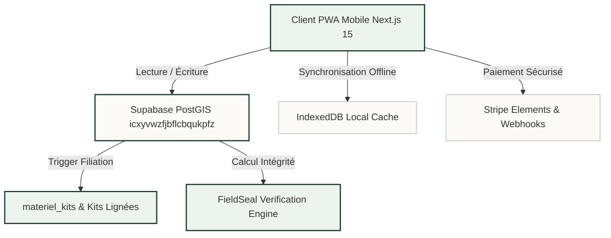

# 📊 Tableau de Bord Exécutif LKDV

Ce tableau de bord résume l'état opérationnel, la qualité du code et les indicateurs vitaux du projet **Le Kit du Voyageur**.

---

## 🚀 Indicateurs Clés de Performance (KPIs)

| Domaine | Métrique | Cible | Statut Actuel | Tendance |
| :--- | :--- | :--- | :--- | :--- |
| **Suite de Tests** | Fichiers passants | 100% | **54 / 54 (100%)** | 🟢 Optimal |
| **Tests Unitaires / Intégration** | Tests exécutés | 100% | **339 / 339 passants** | 🟢 0 échec |
| **Invariants CI** | Script `ci_invariants.mjs` | Zéro faute | **Validé (Code 0)** | 🟢 Conforme |
| **Séparation Lot 6** | Migrations gelées isolées | 100% | **18 fichiers dans `migrations_frozen/`** | 🟢 Hermétique |
| **Projet Supabase Actif** | Identifiant de production | `icxyvwzfjbflcbqukpfz` | **`icxyvwzfjbflcbqukpfz`** | 🟢 Vérifié |
| **Palette Visuelle** | Respect strict Palette v2.0 | Zéro régression | **Forest Green `#17402C`, Pierre `#FBFAF6`** | 🟢 Conforme |
| **Table Matériel Unifiée** | Source unique d'inventaire | `materiel_kits` | **Active ([[06 — 📋 DÉCISIONS (ADR)/ADR-011-Migration-Configurateur-Materiel-Kits|ADR-011]])** | 🟢 Unifiée |

---

## 🛡️ État des Invariants CI Anti-Dérive

> [!important] Garantie d'Intégrité
> Le script `scripts/verify/ci_invariants.mjs` est exécuté lors de chaque cycle de validation. Il certifie :

1. **Aucun Token Banni** :
   - Zéro occurrence du projet fantôme obsolète (`[PROJET_FANTÔME_OBSOLÈTE]`).
   - Zéro occurrence des anciennes teintes vert sombre `#0B1F17` ou `#2D6B4A`.
2. **Isolation Physique du Lot 6** :
   - Le dossier `supabase/migrations/` ne contient **que** les migrations déployables autorisées.
   - Les 18 migrations gelées du Lot 6 sont strictement maintenues dans `supabase/migrations_frozen/` avec leur propre runner autonome.
3. **Contrôle Statique des Types** :
   - `npm run type-check` : TypeScript en mode strict (`tsc --noEmit`), 0 erreur.

---

## 🗺️ Maillage Fonctionnel

---

## 📋 Dernières Décisions Implémentées

- **[[06 — 📋 DÉCISIONS (ADR)/ADR-011-Migration-Configurateur-Materiel-Kits|ADR-011]]** : Décommissionnement de `materiel_catalogue` au profit de `materiel_kits`. Moteur de recommandation IA 100% aligné sur la table vivante.
- **[[06 — 📋 DÉCISIONS (ADR)/ADR-010-Securisation-Triggers-Lignees|ADR-010]]** : Sécurisation du trigger `trg_prevent_lineage_cycle` pour écouter exclusivement les mutations `OF forked_from`.
- **[[03 — 🎨 DESIGN SYSTEM & MOBILE/Gestes Apple HIG|KitSheetModal HIG]]** : Intégration du composant avec swipe-to-dismiss tactile naturel, inertie physique et safe-areas iOS.

---

## 🔗 Liens Rapides
- [[00 — 🗺️ CARTE & NAVIGATION/Index|Retour à l'Index Central]]
- [[00 — 🗺️ CARTE & NAVIGATION/Architecture.canvas|Graphe d'Architecture Visuel]]
- [[00 — 🗺️ CARTE & NAVIGATION/Base-De-Connaissance.base|Explorateur Tabulaire de Notes]]
