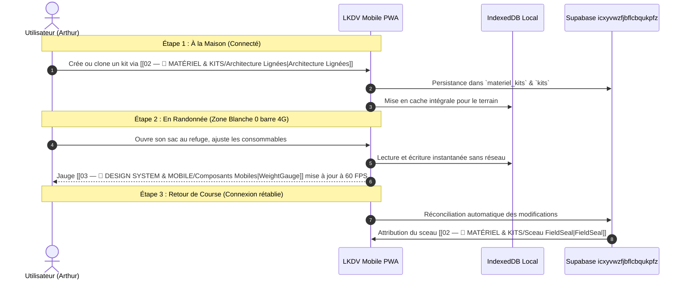

# 🧗 Personas & Cas d'Usage

Pour garantir une adéquation parfaite entre le produit et les réalités du terrain, **Le Kit du Voyageur** s'appuie sur trois personas représentatifs des contraintes extrêmes d'itinérance.

---

## 👤 Fiches Personas

### 1. Arthur — Le Thru-Hiker Ultra-Léger (32 ans)
*« Si ça ne sert pas au moins à deux choses différentes, ça reste à la maison. »*

- **Profil** : Ingénieur logiciel le jour, adepte des grandes traversées estivales (GR20, HexaTrek, PCT).
- **Objectif Ultime** : Un **Base Weight (poids de base)** strictement inférieur à **4,8 kg** pour ménager ses genoux sur 35 km par jour.
- **Points de Douleur** :
  - La redondance des listes sur smartphone qui ne s'ouvrent plus dès qu'on passe un col hors réseau.
  - L'absence d'historique lorsqu'il adapte son kit d'été pour un bivouac d'automne à 2 500 m d'altitude.
- **Fonctionnalités Clés Utilisées** :
  - [[02 — 🎒 MATÉRIEL & KITS/Architecture Lignées|Fork de Lignée]] pour dupliquer son kit "Été Alpin" vers "Automne Humide".
  - [[03 — 🎨 DESIGN SYSTEM & MOBILE/Composants Mobiles|WeightGauge]] pour visualiser l'impact d'un tarp dyneema vs une tente double paroi.
  - [[04 — 🏗️ ARCHITECTURE & BACKEND/Mode Hors-Ligne|Mode Hors-Ligne PWA]] pour pointer son paquetage sous la tente à la frontale.

---

### 2. Camille — La Bikepackeuse Gravel (28 ans)
*« Le poids compte, mais le volume et l'équilibre des sacoches décident de la tenue de route. »*

- **Profil** : Graphiste freelance, traverse des massifs (Vercors, Cévennes, Traversée des Alpes) en vélo gravel sur pistes et sentiers caillouteux.
- **Objectif Ultime** : Optimiser le volume total (< 35 litres répartis entre sacoche de selle, sacoche de cadre et sacoche de cintre) et préserver le centre de gravité bas.
- **Points de Douleur** :
  - Les calculateurs de randonnée pédestre ignorent le volume compressé et la répartition gauche/droite ou avant/arrière.
  - Devoir manipuler des interfaces web minuscules avec les mains engourdies ou des mitaines de vélo.
- **Fonctionnalités Clés Utilisées** :
  - [[03 — 🎨 DESIGN SYSTEM & MOBILE/Gestes Apple HIG|KitSheetModal tactile]] manipulable d'une seule main via un glissement fluide.
  - Filtre de volume et modularité dans le [[02 — 🎒 MATÉRIEL & KITS/Configurateur IA|Configurateur IA]].

---

### 3. Marc — Le Professionnel de la Montagne (46 ans)
*« En tant qu'accompagnateur, le kit de mon client engage ma responsabilité civile et morale. »*

- **Profil** : Accompagnateur en Moyenne Montagne (AMM) diplômé d'État, encadre des groupes d'immersion bivouac dans les Pyrénées et le Mercantour.
- **Objectif Ultime** : Fournir une liste d'équipement infaillible et certifiée à ses stagiaires avant le départ, puis vérifier chaque sac au point de rendez-vous en 5 minutes.
- **Points de Douleur** :
  - Les débutants qui arrivent avec un sac de 18 kg rempli d'objets inutiles ou sans trousse de secours adéquate.
  - La difficulté de prouver qu'un kit a été rigoureusement testé en cas de litige.
- **Fonctionnalités Clés Utilisées** :
  - [[02 — 🎒 MATÉRIEL & KITS/Sceau FieldSeal|Sceau FieldSeal]] pour afficher le badge de certification professionnelle sur les kits partagés.
  - Compte Pro via [[04 — 🏗️ ARCHITECTURE & BACKEND/Intégration Stripe|Stripe]] avec export PDF imprimable et QR code de vérification rapide.

---

## 🔁 Parcours Type : De la Préparation au Sommet

