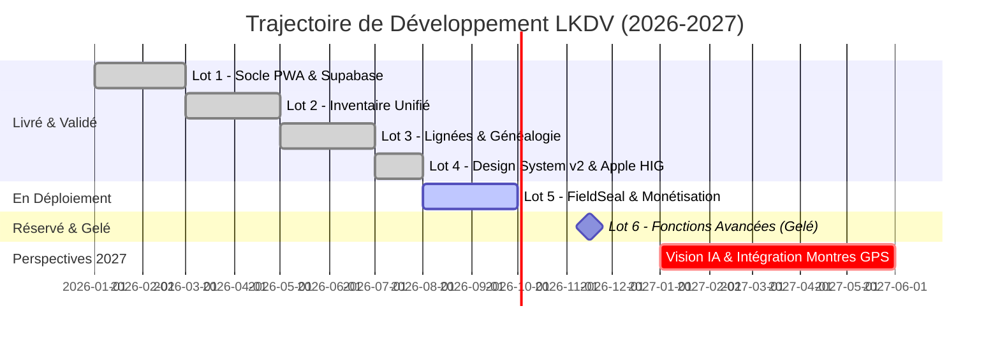

# 📅 Feuille de Route & Jalons 2026-2027

Ce document formalise la trajectoire de développement du projet **Le Kit du Voyageur**, la livraison incrémentale par lots fonctionnels et les orientations futures.

---

## 🧭 Vue Synthétique des Lots

---

## 📦 Détail par Lot Fonctionnel

### ✅ Lot 1 — Socle Technique & Mode Déconnecté
- **Objectif** : Mettre en place les fondations Next.js 15, l'authentification Supabase multilocataire et le service worker PWA pour le fonctionnement en zone blanche.
- **Résultat** : Architecture offline-first opérationnelle, synchronisation automatique dès retour réseau.
- **Référence** : [[06 — 📋 DÉCISIONS (ADR)/ADR-001-Architecture-Nextjs-Supabase|ADR-001]] et [[06 — 📋 DÉCISIONS (ADR)/ADR-002-Mode-Offline-PWA|ADR-002]].

### ✅ Lot 2 — Inventaire Vivant Unifié
- **Objectif** : Structurer le catalogue d'équipements et permettre la personnalisation des fiches matériel.
- **Résultat** : Décommissionnement des silos au profit de la table vivante unique `materiel_kits` (poids, volume, prix, météo, criticité).
- **Référence** : [[06 — 📋 DÉCISIONS (ADR)/ADR-007-Unification-Table-Materiel-Kits|ADR-007]] et [[06 — 📋 DÉCISIONS (ADR)/ADR-011-Migration-Configurateur-Materiel-Kits|ADR-011]].

### ✅ Lot 3 — Lignées de Kits & Généalogie
- **Objectif** : Permettre le fork de kits de référence vers des variantes adaptées (ex: passage d'un kit 3 saisons à une déclinaison hivernale).
- **Résultat** : Clés `forked_from`, trigger PostgreSQL anti-cycles et protection des liens de parenté.
- **Référence** : [[02 — 🎒 MATÉRIEL & KITS/Architecture Lignées|Architecture Lignées]] et [[06 — 📋 DÉCISIONS (ADR)/ADR-010-Securisation-Triggers-Lignees|ADR-010]].

### ✅ Lot 4 — Design System Palette v2.0 & Apple HIG
- **Objectif** : Créer une interface mobile de standard Apple (Human Interface Guidelines), éliminant toute friction sur smartphone en extérieur.
- **Résultat** : Palette v2.0 harmonieuse (`#17402C`, `#FBFAF6`, `#EDF3ED`), geste `KitSheetModal` avec swipe-to-dismiss naturel, inertie haptique et respect strict des safe-areas.
- **Référence** : [[03 — 🎨 DESIGN SYSTEM & MOBILE/Tokens & Palette v2|Tokens & Palette v2]] et [[03 — 🎨 DESIGN SYSTEM & MOBILE/Gestes Apple HIG|Gestes Apple HIG]].

### 🔄 Lot 5 — Épreuve du Terrain & Monétisation Stripe
- **Objectif** : Valider empiriquement les kits par le sceau [[02 — 🎒 MATÉRIEL & KITS/Sceau FieldSeal|FieldSeal]] et activer la souscription Pro pour les guides et pratiquants intensifs.
- **Résultat** : Webhooks Stripe idempotents, calcul d'authenticité terrain des paquetages.
- **Référence** : [[04 — 🏗️ ARCHITECTURE & BACKEND/Intégration Stripe|Intégration Stripe]].

### ❄️ Lot 6 — Migrations Avancées & Résilience (Gelé Physiquement)
- **Objectif** : Réservé aux évolutions d'infrastructure à grand volume.
- **Statut** : **Gelé physiquement** dans `supabase/migrations_frozen/` afin de prémunir le projet de production `icxyvwzfjbflcbqukpfz` contre des dérives de schéma inopportunes lors des `db push`.
- **Référence** : [[06 — 📋 DÉCISIONS (ADR)/ADR-006-Separation-Migrations-Gelees|ADR-006]].

---

## 🔮 Perspectives 2027

1. **Reconnaissance Visuelle par Caméra (IA de Bord)** : Scanner un ensemble d'équipements étalés sur une bâche pour pré-remplir instantanément la liste du kit.
2. **Synchronisation Montres & Compteurs GPS (Garmin, Suunto, Wahoo)** : Déduire automatiquement le ratio calories/eau consommées en temps réel selon la trace enregistrée.
3. **Communauté & Place de Marché de Paquetages Certifiés** : Mise en relation des guides de haute montagne et des novices pour louer ou emprunter des kits complets validés FieldSeal.