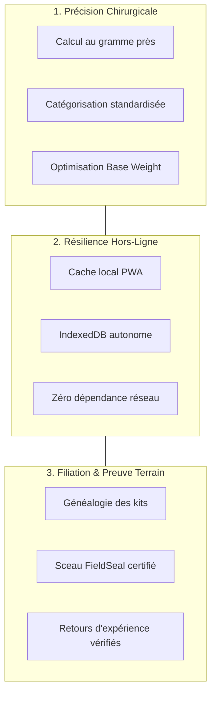

# 🎯 Vision & Proposition de Valeur

**Le Kit du Voyageur (LKDV)** est né d'un constat sans appel : les aventuriers en itinérance (grande randonnée, bikepacking, alpinisme, trek polaire ou désertique) passent des dizaines d'heures à concevoir leurs paquetages sur des tableurs disparates, pour ensuite se retrouver démunis face aux aléas de la météo ou privés d'accès réseau en haute montagne.

> [!abstract] Le Manifeste LKDV
> *"Chaque gramme inutile est une entrave à la liberté du marcheur ; chaque équipement manquant ou défaillant est une menace pour sa sécurité."*

---

## ⛰️ Les Trois Piliers Fondateurs

### 1. Rigueur au Gramme & Culture Ultra-Légère
- Décomposition millimétrée du matériel : **Poids de base** (Base Weight sans consommables), **Poids consommable** (eau, nourriture, gaz) et **Poids porté** (vêtements sur soi, bâtons de marche).
- Recommandations dynamiques basées sur la météo, la saison, le dénivelé et la durée de l'itinéraire via le [[02 — 🎒 MATÉRIEL & KITS/Configurateur IA|Configurateur IA]].
- Visualisation instantanée de la répartition des charges grâce à la jauge ergonomique `WeightGauge` ([[03 — 🎨 DESIGN SYSTEM & MOBILE/Composants Mobiles|Composants Mobiles]]).

### 2. Autonomie Totale en Zone Blanche (Offline-First)
- Les massifs montagneux et sentiers reculés sont structurellement hors de portée du réseau cellulaire.
- Grâce à une architecture PWA moderne et un cache local [[04 — 🏗️ ARCHITECTURE & BACKEND/Mode Hors-Ligne|IndexedDB]], l'utilisateur conserve 100% de ses listes de matériel, ses fiches techniques et ses inventaires consultables et modifiables sans signal 4G/5G.
- Synchronisation bidirectionnelle automatique dès le rétablissement de la connexion.

### 3. Filiation & L'Épreuve du Terrain (FieldSeal)
- Contrairement aux listes statiques, LKDV introduit les **Lignées de Kits** ([[02 — 🎒 MATÉRIEL & KITS/Architecture Lignées|Architecture Lignées]]) : chaque kit peut être dérivé (`forked_from`), adapté à un climat particulier et enrichi.
- L'algorithme [[02 — 🎒 MATÉRIEL & KITS/Sceau FieldSeal|FieldSeal]] décerne un sceau de certification empirique basé sur des traces GPX réelles et des conditions réelles traversées.

---

## 🥊 Analyse Concurrentielle & Différenciateurs

| Critère | Tableur Classique (Excel / Sheets) | Outils Web (LighterPack, GearGram) | **Le Kit du Voyageur (LKDV)** |
| :--- | :--- | :--- | :--- |
| **Expérience Mobile** | Inutilisable sur smartphone avec des gants | Adaptations web partielles, non réactives | **Application native Apple HIG tactile** |
| **Mode Hors-Ligne** | Fichiers locaux sans intelligence dynamique | Page blanche sans réseau | **PWA autonome avec IndexedDB** |
| **Généalogie / Forks** | Copier-coller manuel et perte de l'historique | Inexistant | **Arbre généalogique `forked_from` en BDD** |
| **Certification Terrain** | Aucune preuve tangible | Simples avis textuels non vérifiés | **Sceau FieldSeal horodaté et géolocalisé** |
| **Inventaire Vivant** | Saisie manuelle redondante | Silos isolés | **Table centrale unifiée `materiel_kits`** |

---

## 🔗 Voir Aussi
- [[01 — 🎯 PRODUIT & VISION/Roadmap 2026-2027|Feuille de Route 2026-2027]]
- [[01 — 🎯 PRODUIT & VISION/Personas & Usages|Personas & Typologies d'Usage]]
- [[06 — 📋 DÉCISIONS (ADR)/ADR-001-Architecture-Nextjs-Supabase|ADR-001 : Choix Stack Next.js & Supabase]]