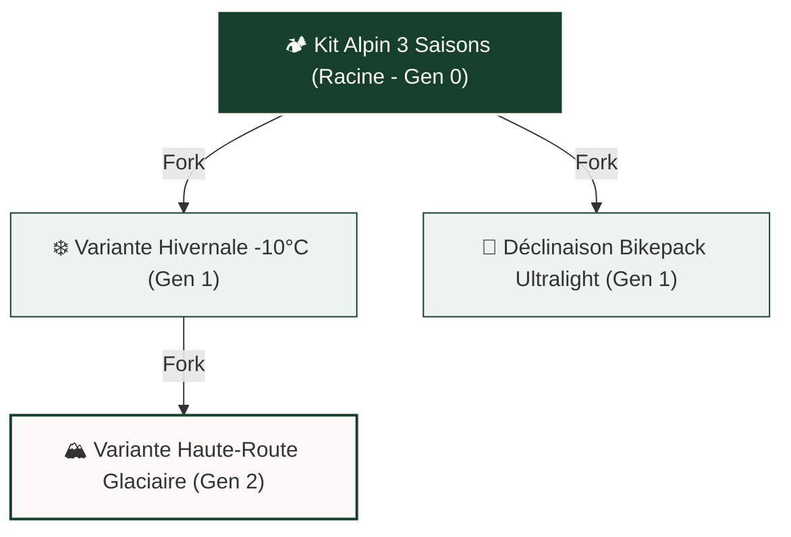

# 🎒 Architecture des Lignées de Kits

Dans **Le Kit du Voyageur**, un paquetage n'est jamais une entité isolée. Tout comme le code logiciel s'enrichit via des branches et des forks, un kit évolue au gré des saisons, des retours d'expérience et des adaptations climatiques.

---

## 🌳 Le Modèle Généalogique

Chaque kit peut être dérivé à partir d'un kit préexistant. Cette dérivation crée un lien de filiation immuable :



### Attributs de la Filiation
Au niveau de la table `kits` dans PostgreSQL Supabase (`icxyvwzfjbflcbqukpfz`) :
- `id` (`UUID`) : Identifiant unique du kit.
- `forked_from` (`UUID`, nullable) : Référence vers le kit parent d'origine.
- `generation` (`INTEGER`) : Profondeur dans l'arbre généalogique (`0` pour le kit racine initial, `N+1` pour chaque dérivation).
- `root_kit_id` (`UUID`) : Référence directe vers le kit ancêtre fondateur de la lignée, facilitant les requêtes récursives performantes sans parcours itératif lourd.

---

## 🛡️ Sécurisation Base de Données : Prévention des Cycles

> [!important] Trigger Anti-Cycle Sécurisé (ADR-010)
> Une corruption d'arbre (boucle de type A -> B -> A) détruirait l'intégrité de l'affichage et provoquerait des récursions infinies.

Le trigger PostgreSQL `trg_prevent_lineage_cycle` veille sur la table `kits` :

```sql
-- Extrait de la fonction de contrôle d'intégrité cyclique
CREATE OR REPLACE FUNCTION check_lineage_cycle()
RETURNS TRIGGER AS $$
DECLARE
    current_parent UUID := NEW.forked_from;
    depth INTEGER := 0;
    max_depth CONSTANT INTEGER := 50;
BEGIN
    IF NEW.forked_from IS NULL THEN
        RETURN NEW;
    END IF;

    IF NEW.forked_from = NEW.id THEN
        RAISE EXCEPTION 'Un kit ne peut pas être dérivé de lui-même (id=%)', NEW.id;
    END IF;

    WHILE current_parent IS NOT NULL AND depth < max_depth LOOP
        IF current_parent = NEW.id THEN
            RAISE EXCEPTION 'Détection de cycle de parenté illicite sur le kit id=%', NEW.id;
        END IF;

        SELECT forked_from INTO current_parent FROM kits WHERE id = current_parent;
        depth := depth + 1;
    END LOOP;

    RETURN NEW;
END;
$$ LANGUAGE plpgsql;
```

Conformément à [[06 — 📋 DÉCISIONS (ADR)/ADR-010-Securisation-Triggers-Lignees|ADR-010]], ce trigger est configuré pour n'écouter que les événements `UPDATE OF forked_from` :
```sql
CREATE TRIGGER trg_prevent_lineage_cycle
BEFORE UPDATE OF forked_from ON kits
FOR EACH ROW EXECUTE FUNCTION check_lineage_cycle();
```
Cela évite de déclencher inutilement cette vérification récursive lors de modifications courantes (mise à jour du nom, de la description ou du statut public).

---

## 🔍 Diffing Intelligent Parent / Dérivé

Lorsqu'un utilisateur consulte un kit dérivé, LKDV met en évidence les ajustements par rapport au kit d'origine :
1. **Éléments Ajoutés (Delta +)** : Équipements de sécurité hivernale, crampons, doudoune grand froid.
2. **Éléments Allégés (Delta -)** : Remplacement d'une popote inox de 350 g par un quart titane de 75 g.
3. **Gain Net de Poids** : Comparatif visuel direct affiché sur la [[03 — 🎨 DESIGN SYSTEM & MOBILE/Composants Mobiles|WeightGauge]].

---

## 🔗 Voir Aussi
- [[02 — 🎒 MATÉRIEL & KITS/Sceau FieldSeal|Sceau FieldSeal & Certification]]
- [[02 — 🎒 MATÉRIEL & KITS/Configurateur IA|Configurateur IA & Moteur de Recommandation]]
- [[06 — 📋 DÉCISIONS (ADR)/ADR-005-Gestion-Filiation-Lignees|ADR-005 : Filiation & Généalogie des Kits]]
- [[06 — 📋 DÉCISIONS (ADR)/ADR-010-Securisation-Triggers-Lignees|ADR-010 : Sécurisation Triggers Lignées]]