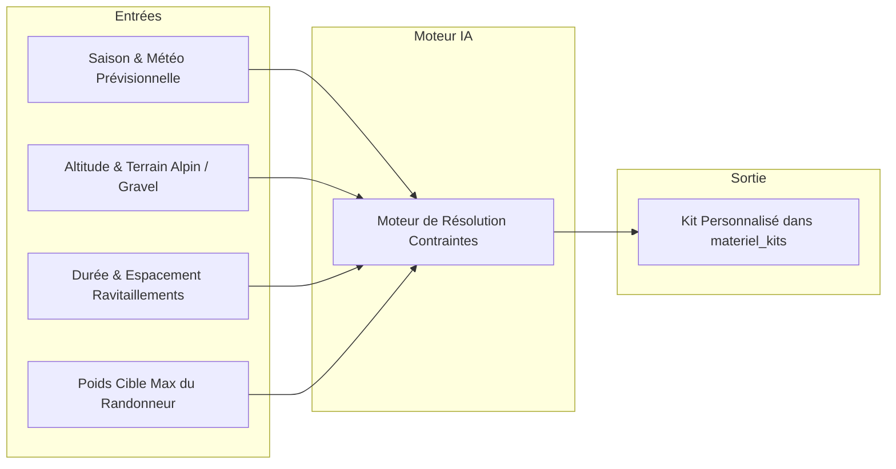

# 🤖 Configurateur IA & Moteur de Recommandation

Le **Configurateur IA** de LKDV analyse les contraintes spécifiques d'une expédition afin de générer une recommandation d'équipement sur-mesure, éliminant les oublis critiques et proscrivant les surcharges inutiles.

> [!important] Décision Fondatrice ADR-011
> Suite à [[06 — 📋 DÉCISIONS (ADR)/ADR-011-Migration-Configurateur-Materiel-Kits|ADR-011]], le configurateur n'interroge plus de catalogue statique obsolète (`materiel_catalogue`), mais puise directement dans la table vivante unifiée **`materiel_kits`**. Chaque recommandation est donc immédiatement disponible dans le stock réel de l'utilisateur ou de la communauté.

---

## 📥 Paramètres d'Entrée de l'Analyse

Le configurateur ingère une série de variables physiologiques, géographiques et météorologiques :



1. **Environnement Géographique & Relief** :
   - *Plaine / Bocage* (climat tempéré, marche régulière).
   - *Moyenne Montagne* (variations thermiques rapides, passages rocheux).
   - *Haute Montagne Alpinisme* (gel nocturne systématique, équipement de sécurité technique).
   - *Bikepacking Gravel* (volume restreint, rigidité de portage).
2. **Plage Thermique Prévue** :
   - Température de confort nécessaire pour le système de couchage (sac de couchage + matelas avec valeur R-Value adéquate).
3. **Plafond de Base Weight Cible** :
   - Limite stricte définie par l'utilisateur (ex: 4 500 g).

---

## ⚡ Algorithme de Sélection & Équilibrage

L'algorithme opère en quatre passes successives :

```
Passe 1 : Sélection des Incompressibles de Sécurité (Trousse premiers secours, lampe, filtration)
Passe 2 : Dimensionnement du Triptyque Sommeil (Tente/Tarp, Sac de couchage, Matelas adapté R-value)
Passe 3 : Vêtements Techniques (Règle des 3 couches respirante / thermique / imperméable)
Passe 4 : Optimisation Fine du Poids (Élagage des doublons, ajustement consommables)
```

1. **Sécurité Incompressible** : Aucune recommandation ne peut omettre les éléments vitaux (couverture de survie, sifflet, désinfection d'eau).
2. **Compatibilité Thermique** : Le matelas et le duvet sont choisis pour garantir une température limite supérieure de 3°C par rapport au minimum météo annoncé.
3. **Gestion du Sac à Dos** : Le volume du sac à dos (litrage) est automatiquement dimensionné pour accueillir l'ensemble des éléments compactés sans compression forcée destructrice pour les garnissages en duvet.

---

## 🔄 Réconciliation avec les Lignées

Une fois la configuration générée :
- L'utilisateur peut l'enregistrer comme kit racine ou la brancher sur une lignée existante via [[02 — 🎒 MATÉRIEL & KITS/Architecture Lignées|Architecture Lignées]].
- Les modifications manuelles de l'utilisateur nourrissent l'historique d'apprentissage de son profil.

---

## 🔗 Voir Aussi
- [[02 — 🎒 MATÉRIEL & KITS/Architecture Lignées|Architecture des Lignées de Kits]]
- [[02 — 🎒 MATÉRIEL & KITS/Épreuve du Terrain|L'Épreuve du Terrain]]
- [[06 — 📋 DÉCISIONS (ADR)/ADR-011-Migration-Configurateur-Materiel-Kits|ADR-011 : Migration Configurateur vers `materiel_kits`]]