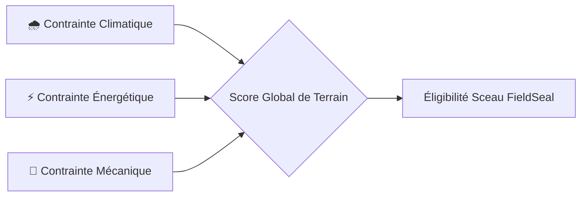

# 🏔️ L'Épreuve du Terrain

Dans le monde de l'outdoor, un équipement séduisant sur le papier peut s'avérer catastrophique dans la tourmente. **L'Épreuve du Terrain** est le protocole rigoureux par lequel un kit passe du statut de *projection théorique* à celui de *paquetage éprouvé*.

> [!quote] Règle d'Or de l'Itinérance
> *"Un kit n'est pas optimisé quand il n'y a plus rien à ajouter, mais quand il n'y a plus rien à enlever sans compromettre la survie de son porteur."*

---

## 🔬 Les Trois Vecteurs de Contrainte

### 1. La Contrainte Climatique & Hygrométrique
- **Pluie Battante Prolongée** : Vérification de l'étanchéité des sacs étanches et du double-toit après 6 heures sous précipitations continues.
- **Gel & Choc Thermique** : Comportement des réchauds à gaz en dessous de -5°C (nécessité de mélanges isobutane/propane ou réchaud à essence).
- **Condensation de Bivouac** : Évaluation du point de rosée dans les tentes mono-paroi et sacs de couchage en duvet face à l'humidité ambiante.

### 2. La Contrainte Énergétique & Métabolique
- **Apport Calorique Réel** : Ratio poids de nourriture / apport journalier (cible : ~3 500 kcal pour un poids sec < 800 g / jour).
- **Ressource Hydrique** : Disponibilité des points d'eau et redondance de traitement (filtre à fibres creuses + pastilles de dioxyde de chlore).
- **Énergie Embarquée** : Rendement des batteries externes (Li-ion ou Li-FePO4) à basse température pour alimenter le smartphone et la lampe frontale.

### 3. La Contrainte Mécanique & Usure
- **Résistance à l'Abrasion** : Frottements répétés sur le rocher granitique ou calcaire.
- **Tenue des Fermetures Éclair** : Résistance à la poussière et à la boue.
- **Réparabilité d'Urgence** : Présence d'un kit de secours matériel (ruban adhésif armé, colle seam-grip, aiguille et fil renforcé).

---

## 📊 Grille d'Évaluation Multidimensionnelle

Chaque kit soumis à l'épreuve reçoit une note sur 100 décomposée comme suit :

| Dimension | Poids | Facteur Clé de Succès | Seuil Minimal Requis |
| :--- | :--- | :--- | :--- |
| **Résilience Vitale** | 40% | Zéro défaillance sur le triptyque Abri / Chaleur / Hydratation | 90 / 100 |
| **Précision du Poids** | 30% | Écart entre le poids estimé et le poids pesé sur balance | ± 3% max |
| **Compacité & Équilibre**| 20% | Répartition de charge ergonomique (centre de gravité) | 75 / 100 |
| **Polyvalence Climatique**| 10% | Capacité à affronter un écart soudain de température de 15°C | 70 / 100 |

---

## 🔗 Voir Aussi
- [[02 — 🎒 MATÉRIEL & KITS/Sceau FieldSeal|Sceau FieldSeal & Certification Communautaire]]
- [[02 — 🎒 MATÉRIEL & KITS/Architecture Lignées|Architecture des Lignées de Kits]]
- [[01 — 🎯 PRODUIT & VISION/Personas & Usages|Personas & Typologies d'Usage]]