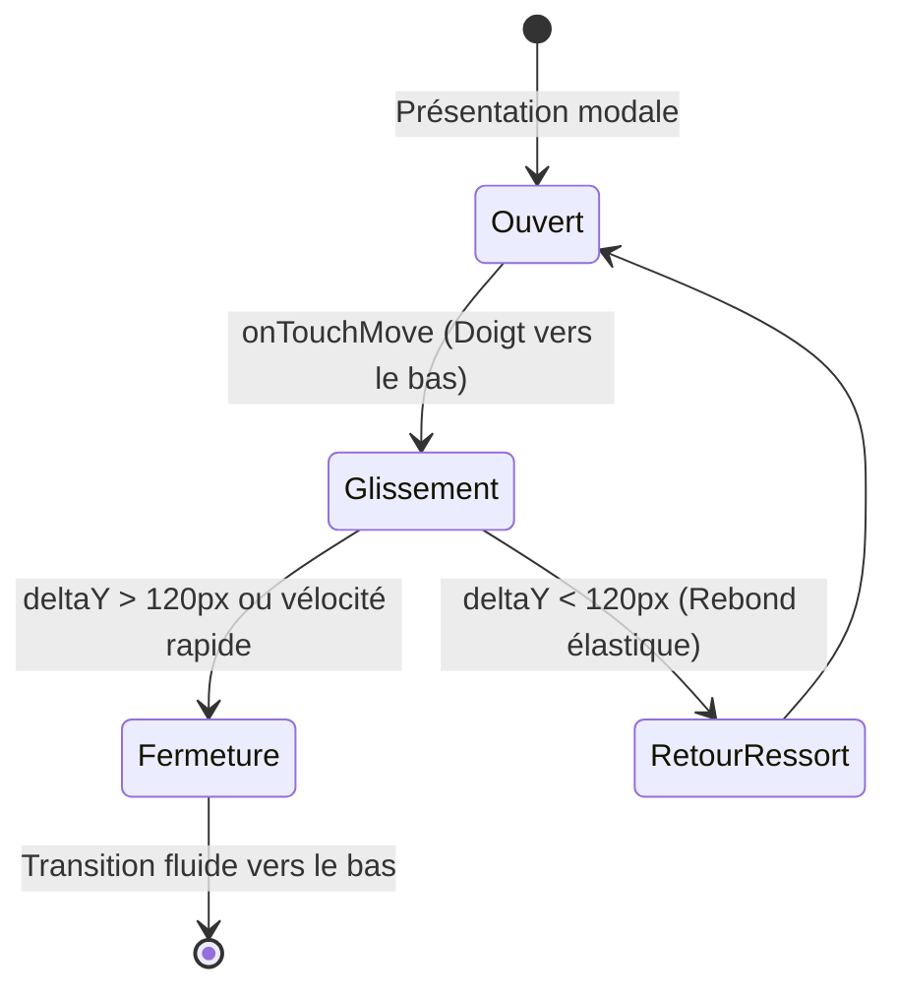

# 👆 Gestes Apple HIG & Friction Tactile

L'utilisation d'un smartphone sur le terrain (avec des doigts froids, des gants fins ou sous une averse) exige une réactivité gestuelle infaillible et une prédictibilité physique absolue.

> [!abstract] Philosophie HIG
> Une interface tactile ne doit pas simplement répondre à un clic : elle doit donner la sensation physique d'un objet matériel doté de masse, de friction et de rebond.

---

## 📱 Spécification de `KitSheetModal`

Le composant modal phare de LKDV adopte le comportement d'une **Bottom Sheet native iOS** :



### 1. Poignée de Préhension (Drag Handle)
- Située au sommet centré : `w-12 h-1.5 rounded-full bg-[#17402C]/20`.
- Zone tactile élargie (Hit Target) de 48px pour faciliter l'accroche même avec des gants.

### 2. Physique du Glissement (Friction & Résistance)
- **Traction vers le Bas** : Déplacement 1:1 suivant scrupuleusement la coordonnée du doigt (`translateY = currentY - startY`).
- **Traction vers le Haut (Overscroll)** : Résistance élastique progressive :
  $$\Delta Y_{effectif} = \Delta Y \times 0.2$$
  Cette résistance procure la sensation tactile que le panneau est ancré au sommet de la vue.

### 3. Conditions de Fermeture (Dismiss Logic)
Une feuille modale se ferme automatiquement si :
1. La distance parcourue vers le bas dépasse **120 pixels**.
2. OU la vélocité instantanée lors du relâchement dépasse **0.5 px/ms** (flick dismissal).
3. À défaut, le composant réenclenche une animation de rappel élastique vers sa position initiale (`transform: translateY(0px)`).

---

## 🛡️ Respect des Zones de Sécurité (Safe Areas)

Pour éviter tout chevauchement avec la barre d'accueil (Home Indicator) des iPhones ou la barre de navigation Android :

```css
/* Application systématique des marges système */
.mobile-sheet-content {
  padding-bottom: calc(1rem + env(safe-area-inset-bottom, 20px));
}
```

---

## ♿ Accessibilité & Clavier
- **Touche Échap (Escape)** : Fermeture immédiate de la modale.
- **Rôles ARIA** : `role="dialog"`, `aria-modal="true"`, et piégeage du focus tabulaire à l'intérieur de la vue active.
- **Verrouillage du Défilement Sous-Jacent** : Blocage du scroll de l'arrière-plan (`overflow: hidden` sur `document.body`) tant que la feuille est visible.

---

## 🔗 Voir Aussi
- [[03 — 🎨 DESIGN SYSTEM & MOBILE/Composants Mobiles|Composants Mobiles & Fiches]]
- [[03 — 🎨 DESIGN SYSTEM & MOBILE/Tokens & Palette v2|Tokens & Palette v2]]
- [[06 — 📋 DÉCISIONS (ADR)/ADR-011-Migration-Configurateur-Materiel-Kits|ADR-011 : Intégration KitSheetModal]]