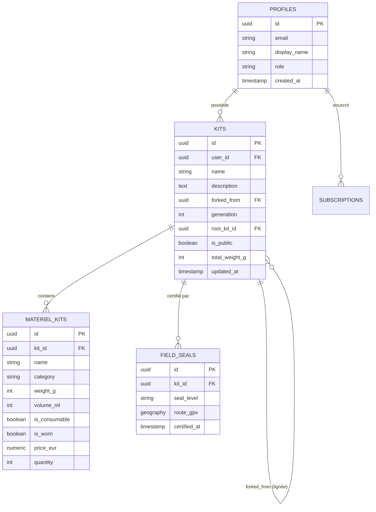

# 🗄️ Base de Données & Schéma Relationnel

La couche de données repose sur **PostgreSQL 15** hébergé sur **Supabase** (Projet officiel : **`icxyvwzfjbflcbqukpfz`**).

---

## 🗺️ Schéma Entité-Association Simplifié

---

## 📑 Description des Tables Clés

### 1. `kits` — Les Paquetages & la Généalogie
- Stocke l'en-tête de chaque kit de voyage.
- Clés de filiation : `forked_from` pointe vers le parent direct, `root_kit_id` pointe vers la racine originelle.
- Protégée par le trigger `trg_prevent_lineage_cycle` qui interdit la formation de boucles récursives ([[02 — 🎒 MATÉRIEL & KITS/Architecture Lignées|Architecture Lignées]]).

### 2. `materiel_kits` — L'Inventaire Vivant Unifié
- **Rôle** : Table unique matérialisant chaque équipement associé à un kit.
- **Historique** : Conformément à [[06 — 📋 DÉCISIONS (ADR)/ADR-007-Unification-Table-Materiel-Kits|ADR-007]] et [[06 — 📋 DÉCISIONS (ADR)/ADR-011-Migration-Configurateur-Materiel-Kits|ADR-011]], tous les anciens catalogues découplés ont été migrés et unifiés dans cette table vivante.
- Attributs critiques :
  - `weight_g` : Poids unitaire en grammes.
  - `is_consumable` : Indique si l'article est consommé au fil de la marche (nourriture, eau, combustible).
  - `is_worn` : Indique si l'équipement est porté sur soi (vêtements, chaussures, montre, bâtons).
  - `category` : Catégorie normalisée (`abri`, `couchage`, `cuisine`, `hydratation`, `vetements`, `securite`, `divers`).

### 3. `field_seals` — Les Certifications Terrain
- Atteste de la réalisation d'une épreuve terrain validée.
- Utilise le type `geography` de **PostGIS** pour stocker et valider la trace de parcours GPX.

---

## ⚡ Triggers & Fonctions de Calcul Automatique

1. **Calcul Automatique du Poids Total** :
   Un trigger `AFTER INSERT OR UPDATE OR DELETE ON materiel_kits` recalcule instantanément la colonne `total_weight_g` et le Base Weight sur le kit parent correspondant.
2. **Trigger Anti-Cycle Lignées (ADR-010)** :
   Vérification stricte de l'absence de cycles lors des mises à jour du champ `forked_from` sur la table `kits`.

---

## 🔗 Voir Aussi
- [[04 — 🏗️ ARCHITECTURE & BACKEND/Stack & Fondations|Stack Technique & Fondations]]
- [[05 — 🛡️ SÉCURITÉ & INVARIANTS/Politiques RLS|Politiques RLS & Sécurité]]
- [[06 — 📋 DÉCISIONS (ADR)/ADR-007-Unification-Table-Materiel-Kits|ADR-007 : Table Unique Vivante materiel_kits]]