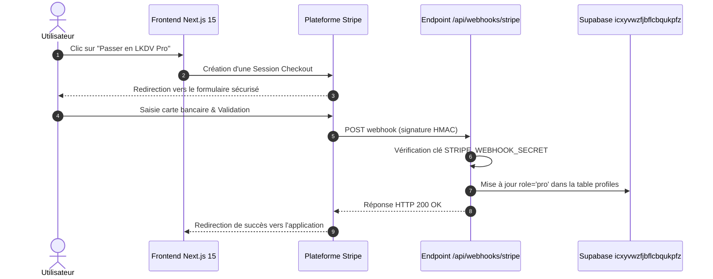

# 💳 Intégration Paiement & Webhooks Stripe

Le modèle économique de **Le Kit du Voyageur** associe une version d'accès libre complète pour les randonneurs individuels et un abonnement **LKDV Pro** destiné aux passionnés intensifs et aux professionnels de la montagne (guides, clubs).

---

## 🔒 Sécurisation Cryptographique & Idempotence

> [!important] Règle de Sécurité des Webhooks
> Tout événement envoyé par Stripe vers l'endpoint `/api/webhooks/stripe` fait l'objet d'une vérification de signature cryptographique HMAC-SHA256 (`stripe-signature`) avant le moindre traitement.

---

## 🎯 Événements Webhooks Pris en Charge

| Événement Stripe | Action Déclenchée dans LKDV | Impact Base de Données |
| :--- | :--- | :--- |
| `checkout.session.completed` | Activation instantanée des fonctionnalités Pro | Inscription dans `subscriptions`, mise à jour de `profiles.role` |
| `customer.subscription.updated` | Gestion des renouvellements ou changements de formule | Actualisation de `current_period_end` et du statut |
| `customer.subscription.deleted` | Résiliation en fin de période ou impayé | Rétrogradation douce vers le statut gratuit sans perte de kits |
| `invoice.payment_failed` | Notification par email et bandeau d'alerte | Mise en période de grâce |

---

## 🛡️ Traitement Idempotent

Pour se prémunir contre les réémissions multiples d'un même webhook réseau par Stripe :
1. Chaque identifiant d'événement `event.id` est stocké dans une table d'audit `stripe_processed_events`.
2. Si un événement a déjà été traité, l'endpoint répond immédiatement un code `200 OK` sans réexécuter les mutations de base de données.

---

## 🔗 Voir Aussi
- [[04 — 🏗️ ARCHITECTURE & BACKEND/Stack & Fondations|Stack Technique & Fondations]]
- [[04 — 🏗️ ARCHITECTURE & BACKEND/BDD & Schéma|Schéma de Données Supabase]]
- [[01 — 🎯 PRODUIT & VISION/Roadmap 2026-2027|Feuille de Route & Jalons]]