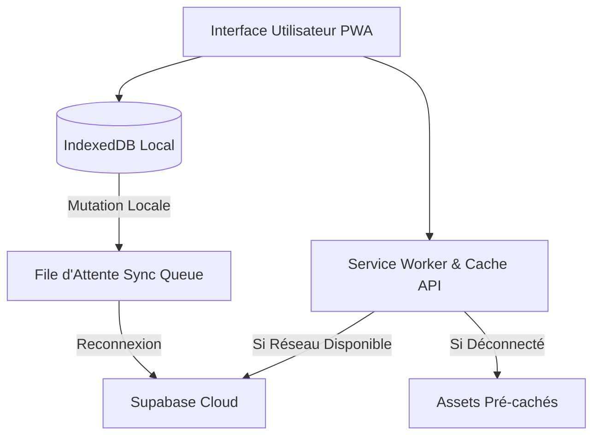

# 📶 Mode Hors-Ligne & Architecture PWA

En haute montagne ou au cœur d'une forêt reculée, l'accès au réseau cellulaire est inexistant. Pour un aventurier, une application qui refuse de s'ouvrir faute de connexion est inutile et potentiellement dangereuse.

> [!important] Contrat Offline-First (ADR-002)
> **Le Kit du Voyageur** traite l'absence de réseau non pas comme une erreur, mais comme l'état normal et nominal d'utilisation en itinérance.

---

## 🏗️ Architecture du Pipeline Hors-Ligne

### 1. Mise en Cache des Assets Applicatifs (Service Worker)
- **Stratégie Cache-First pour les Fichiers Statiques** : Tous les bundles JavaScript, styles CSS, polices SF Pro et icônes SVG sont pré-chargés lors de la première visite.
- L'application se lance en moins de **300 ms**, même en mode avion complet.

### 2. Persistance des Données dans IndexedDB
- Les tables locales miroir répliquent la structure de Supabase :
  - `offline_kits`
  - `offline_materiel_kits`
  - `offline_user_profile`
- Toutes les opérations de consultation, ajout, modification ou suppression s'exécutent d'abord sur la base locale.

---

## 🔄 Stratégie de Synchronisation & Résolution de Conflits

Lorsque le smartphone retrouve une couverture réseau :
1. **Écoute de l'événement système `navigator.onLine`** et de l'événement `sync` du Service Worker.
2. **Vidage de la File d'Attente (`Sync Queue`)** : Les mutations stockées sont envoyées séquentiellement à Supabase.
3. **Arbitrage des Conflits (Horodatage Vectoriel)** :
   - Par défaut, la règle du dernier auteur prévaut (*Last-Write-Wins* basé sur le champ `updated_at`).
   - Si un conflit structurel majeur survient sur une lignée de kit, la version locale est dupliquée en tant que variante de secours pour éviter toute perte d'informations.

---

## 🎨 Retours Visuels pour l'Utilisateur

L'utilisateur est constamment informé de son état réseau :
- Affichage discret du composant `OfflineBanner` ([[03 — 🎨 DESIGN SYSTEM & MOBILE/Composants Mobiles|Composants Mobiles]]) lorsqu'aucune liaison radio n'est disponible.
- Indicateur de sauvegarde locale garantissant que le paquetage n'est pas perdu.

---

## 🔗 Voir Aussi
- [[04 — 🏗️ ARCHITECTURE & BACKEND/Stack & Fondations|Stack Technique & Fondations]]
- [[03 — 🎨 DESIGN SYSTEM & MOBILE/Composants Mobiles|Composants Mobiles & Bannières]]
- [[06 — 📋 DÉCISIONS (ADR)/ADR-002-Mode-Offline-PWA|ADR-002 : Stratégie Offline-First PWA]]