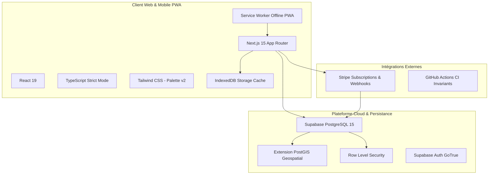

# 🏗️ Stack Technique & Fondations

L'architecture de **Le Kit du Voyageur** est sélectionnée pour garantir performance, résilience déconnectée et maintenabilité stricte à long terme.

---

## 🧰 Vue d'Ensemble de la Stack

### 1. Frontend & Client Mobile
- **Next.js 15 (App Router)** : Rendu hybride (Server Components pour le référencement et la rapidité initiale, Client Components optimisés pour les interactions tactiles).
- **React 19** : Gestion des transitions fluides, hooks d'optimisme et d'actions serveur.
- **Tailwind CSS (Palette v2.0)** : Design system strict basé sur les variables de design [[03 — 🎨 DESIGN SYSTEM & MOBILE/Tokens & Palette v2|Tokens & Palette v2]].
- **Mode Hors-Ligne** : Service Worker interceptant les requêtes réseau et basculant en toute transparence sur IndexedDB ([[04 — 🏗️ ARCHITECTURE & BACKEND/Mode Hors-Ligne|Mode Hors-Ligne]]).

### 2. Base de Données & Backend
- **Supabase Cloud (PostgreSQL 15 + PostGIS)** :
  - Identifiant officiel du projet : **`icxyvwzfjbflcbqukpfz`** (toute référence à l'ancien identifiant obsolète `[PROJET_FANTÔME_OBSOLÈTE]` est rigoureusement bloquée par la CI).
  - Gestion spatiale via PostGIS pour le tracé des itinéraires de randonnée et l'attribution du [[02 — 🎒 MATÉRIEL & KITS/Sceau FieldSeal|Sceau FieldSeal]].
  - Sécurité étanche assurée par les [[05 — 🛡️ SÉCURITÉ & INVARIANTS/Politiques RLS|Politiques RLS]].

### 3. Assurance Qualité & Validation Continue
- **Vitest & React Testing Library** : Suite de tests ultrarapide couvrant **54 fichiers et 339 tests unitaires et d'intégration** (100% de réussite).
- **Garde-Fous CI** : Script automatisé `scripts/verify/ci_invariants.mjs` vérifiant l'absence de régressions chromatiques ou d'identifiants de base invalides ([[05 — 🛡️ SÉCURITÉ & INVARIANTS/Invariants CI Anti-Dérive|Invariants CI]]).

---

## 🔗 Voir Aussi
- [[04 — 🏗️ ARCHITECTURE & BACKEND/BDD & Schéma|Schéma de Données Supabase]]
- [[04 — 🏗️ ARCHITECTURE & BACKEND/Mode Hors-Ligne|Architecture Hors-Ligne & PWA]]
- [[06 — 📋 DÉCISIONS (ADR)/ADR-001-Architecture-Nextjs-Supabase|ADR-001 : Choix Stack Next.js & Supabase]]