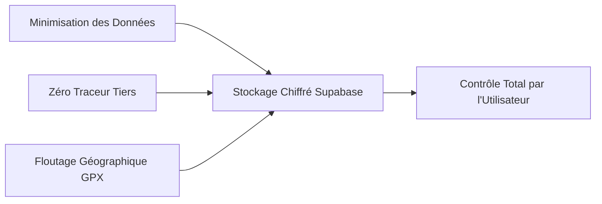

# 🔒 Données Personnelles & Conformité RGPD

La confiance des aventuriers repose sur une transparence absolue. **Le Kit du Voyageur** est conçu selon le principe de *Privacy by Design* et applique rigoureusement les dispositions du Règlement Général sur la Protection des Données (RGPD - Règlement UE 2016/679).

---

## 🎯 Principes Directeurs

### 1. Principe de Minimisation Stricte
- LKDV ne collecte que le strict minimum nécessaire au fonctionnement du service : adresse email (pour l'authentification sécurisée) et les caractéristiques techniques du matériel (poids, catégories).
- **Zéro Régie Publicitaire** : Aucun SDK de tracking ou pixel tiers n'est incorporé au code source.

### 2. Protection de la Vie Privée Géographique (Traces GPX)
Pour les traces de randonnée associées au [[02 — 🎒 MATÉRIEL & KITS/Sceau FieldSeal|Sceau FieldSeal]] :
- Nettoyage automatique des métadonnées EXIF et horodatages privés non pertinents.
- Application optionnelle d'une **zone tampon de confidentialité (Geofence)** : les premiers et derniers 500 mètres de chaque trace peuvent être masqués pour ne pas divulguer l'adresse du domicile de l'utilisateur.

---

## 👤 Droits des Utilisateurs

| Droit RGPD | Modalité de Mise en Œuvre dans LKDV | Délai |
| :--- | :--- | :--- |
| **Droit d'Accès & Portabilité** (Art. 20) | Téléchargement en un clic de l'archive complète de ses kits (JSON / CSV standardisé) | Instantané |
| **Droit à l'Effacement** (Art. 17) | Bouton « Supprimer définitivement mon compte » dans les paramètres de profil | Immédiat (Suppression en cascade BDD) |
| **Droit de Rectification** (Art. 16) | Modification libre et directe de toutes les fiches d'inventaire | Instantané |

---

## 🔐 Sécurité & Chiffrement
- Toutes les communications sont chiffrées de bout en bout en **TLS 1.3**.
- Les bases de données PostgreSQL hébergées sur Supabase sont chiffrées au repos via **AES-256**.
- Les mots de passe ne transitent jamais en clair et sont hachés avec un sel cryptographique robuste via Supabase Auth (GoTrue).

---

## 🔗 Voir Aussi
- [[05 — 🛡️ SÉCURITÉ & INVARIANTS/Politiques RLS|Politiques RLS]]
- [[04 — 🏗️ ARCHITECTURE & BACKEND/BDD & Schéma|Schéma de Données Supabase]]
- [[04 — 🏗️ ARCHITECTURE & BACKEND/Intégration Stripe|Intégration Stripe]]