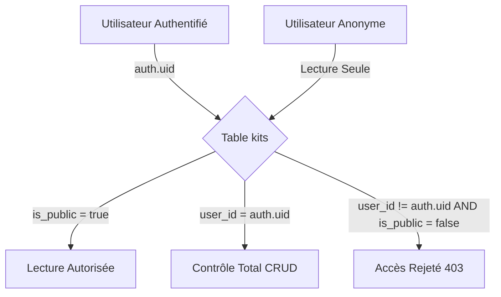

# 🛡️ Politiques RLS (Row Level Security)

L'intégrité et la confidentialité des paquetages reposent sur l'activation stricte de **Row Level Security (RLS)** sur l'intégralité des tables PostgreSQL du projet Supabase (`icxyvwzfjbflcbqukpfz`).

> [!important] Règle Fondamentale de Sécurité
> **Aucune table publique ne peut être interrogée sans politique RLS explicite.** Le rôle `anon` ne peut lire que les kits marqués explicitement comme publics.

---

## 🔒 Vue d'Ensemble des Politiques par Table



### 1. Table `kits`
```sql
-- Activer RLS
ALTER TABLE kits ENABLE ROW LEVEL SECURITY;

-- Lecture : Les kits publics sont visibles de tous ; les kits privés ne sont visibles que de leur auteur
CREATE POLICY "Lecture des kits autorisée" ON kits
FOR SELECT USING (
    is_public = true OR auth.uid() = user_id
);

-- Insertion : L'utilisateur ne peut créer un kit que pour son propre compte
CREATE POLICY "Création de ses propres kits" ON kits
FOR INSERT WITH CHECK (
    auth.uid() = user_id
);

-- Modification : Seul le propriétaire peut modifier son kit
CREATE POLICY "Modification de ses propres kits" ON kits
FOR UPDATE USING (
    auth.uid() = user_id
);

-- Suppression : Seul le propriétaire peut supprimer son kit
CREATE POLICY "Suppression de ses propres kits" ON kits
FOR DELETE USING (
    auth.uid() = user_id
);
```

### 2. Table `materiel_kits` (Inventaire Vivant)
La sécurité des articles découle directement de la propriété du kit parent :

```sql
ALTER TABLE materiel_kits ENABLE ROW LEVEL SECURITY;

-- Lecture autorisée si le kit parent est lisible
CREATE POLICY "Lecture du matériel lié" ON materiel_kits
FOR SELECT USING (
    EXISTS (
        SELECT 1 FROM kits
        WHERE kits.id = materiel_kits.kit_id
        AND (kits.is_public = true OR kits.user_id = auth.uid())
    )
);

-- Écriture strictement restreinte au propriétaire du kit parent
CREATE POLICY "Écriture du matériel par le propriétaire" ON materiel_kits
FOR ALL USING (
    EXISTS (
        SELECT 1 FROM kits
        WHERE kits.id = materiel_kits.kit_id
        AND kits.user_id = auth.uid()
    )
);
```

---

## 🧪 Validation & Tests de Non-Régression

Chaque livraison logicielle inclut des tests Vitest automatisés simulant des tentatives d'accès croisées entre utilisateurs différents afin de prouver formellement :
1. Qu'un utilisateur B ne peut pas modifier ni effacer un kit privé de l'utilisateur A.
2. Qu'une tentative d'injection SQL ou d'usurpation d'identifiant `auth.uid()` est interceptée nativement au niveau du moteur PostgreSQL.

---

## 🔗 Voir Aussi
- [[04 — 🏗️ ARCHITECTURE & BACKEND/BDD & Schéma|Schéma de Données Supabase]]
- [[05 — 🛡️ SÉCURITÉ & INVARIANTS/Invariants CI Anti-Dérive|Invariants CI & Garde-Fous]]
- [[05 — 🛡️ SÉCURITÉ & INVARIANTS/Données Privées & RGPD|Données Privées & RGPD]]